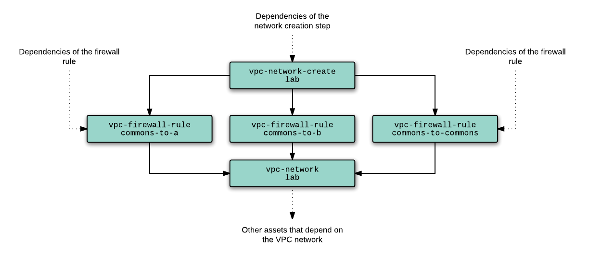
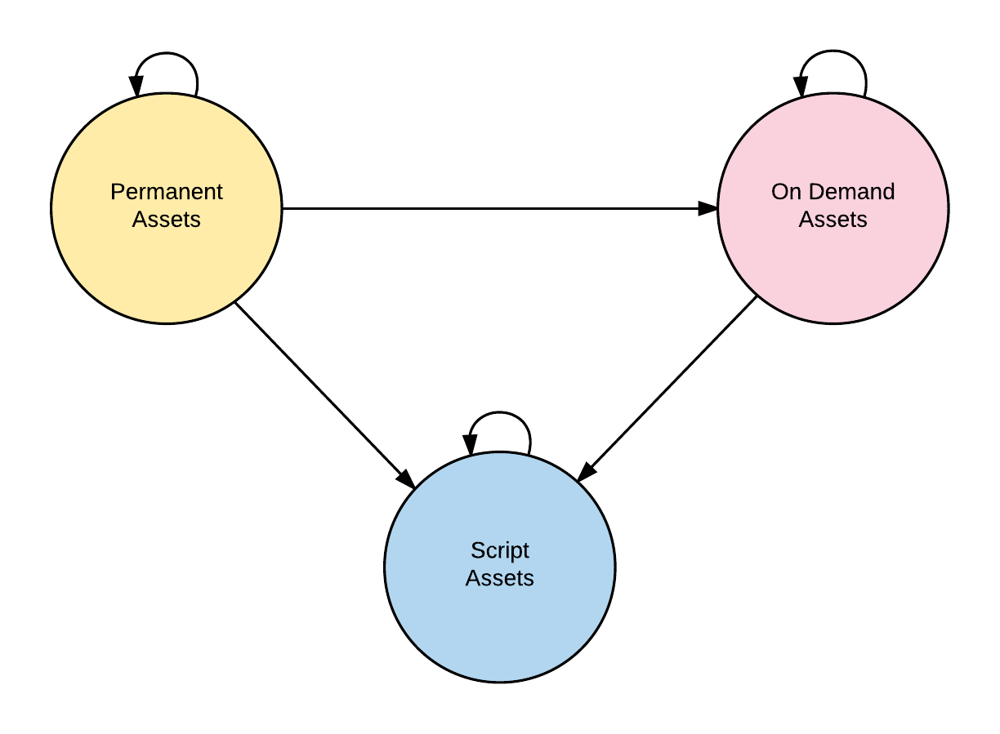

# DEPLOYMENT DETAILS

[TOC]

The [DEPLOYER][] section has a summary of what the deployment service does.  In
this section we dive into the fun details. This document assumes familiarity
with the overall [Design][].


## Deployment Overview                                               {#overview}

The deployment stages are as follows:

1.  [**Parsing**](#parsing): The [DEPLOYER][] parses the configuration files
    which as specified in the form of `textproto`s.

1.  [**Pre-Validation**](#prevalidation): The parsed configuration is validated according to
    [Schema Validation][] but excluding any [Inline References][] to `OUTPUT`
    fields.

1.  [**Pruning**](#pruning):  In cases where only part of the configuration needs to be
    deployed, the [DEPLOYER][] will prune assets and host resources that are not
    referenced by any assets that are required to be deployed. This phase allows
    deployment of a subset of assets.

1.  [**Plan Construction**](#planning): The [DEPLOYER][] constructs a plan to
    deploy all the assets remaining after the *Pruning* stage. The plan consists
    of a set of operations and their dependencies. Each operation has a set of
    outputs that are considered valid after the operation completes
    successfully. Operations that directly or indirectly depend on one operation
    can also depend on the latter's outputs.

1.  [**Plan Execution**](#execution): During this phase each of the operations
    are executed with parallelization. The [DEPLOYER][] is responsible for
    invoking and gathering the results of the operations as they occur either
    within the `DEPLOYER` process or triggered remotely.

    Execution itself may consist of a number of phases where operations
    belonging to one phase can be parallelized with respect to each other.

## Parsing                                                            {#parsing}

The deployment process takes as input, the [ASSET MANIFEST][] that was passed in
as a part of the [ISOLATE][], and another set of configuration files -- [HOST
ENVIRONMENT][] -- that is provided at the time the lab is instantiated or updated.
The latter also conforms to the [Asset Description Schema][] and declares assets
and properties that are specific to the environment hosting the lab.

The separation between [ASSET MANIFEST][] and [HOST ENVIRONMENT][] allows the
enterprise lab to be hosted on multiple locations and easily cloned or
relocated. The tests in the Chromium repository are agnostic of the hosting
details.

The deployment process combines the configuration from these two sets of files
to compile the complete set of assets needed for the test suite.

An asset manifest file looks like this ([Asset Example][]):

<!-- INCLUDE ../examples/schema/ad/one-domain.asset.textpb (51 lines) fenced as conf -->
``` conf
# Copyright 2017 The Chromium Authors. All rights reserved.
# Use of this source code is governed by a BSD-style license that can be
# found in the LICENSE file.

# The network. There should be at least one. Hosts in the same network can talk
# to each other without any restrictions.
network {
  name: 'primary'
}

# An ActiveDirectory domain.
ad_domain {
  name: 'foo.example'

  # AD Domain Controller. This is regarded as a service that runs on a specific
  # machine. This definition just anchors the AD DS to the machine named 'dc'.
  domain_controller {
    windows_machine: 'dc'
  }
}

# A Windows machine.
windows_machine {
  name: 'dc'
  machine_type: 'win2012r2'
  network_interface { network: 'primary' }
}

# Another Windows machine.
windows_machine {
  name: 'client'
  machine_type: 'win2012r2'
  network_interface { network: 'primary' }

  # This one explicitly lists 'foo.example' as the domain to which this machine
  # belongs. This will result in this machine being automatically joined to
  # 'foo.example' using the default domain administrator credentials.
  container { ad_domain: 'foo.example' }
}

# A Windows user.
windows_user {
  name: 'joe'
  description: 'Joe The User'

  # This is a domain user. The user will not be made a member of any additional
  # groups since there are no member_of entries.
  container { ad_domain: 'foo.example' }
}
```

The corresponding host environment could look like this ([Host Example][]):

<!-- INCLUDE ../examples/schema/ad/one-domain.host.textpb (65 lines) fenced as conf -->
``` conf
# Copyright 2017 The Chromium Authors. All rights reserved.
# Use of this source code is governed by a BSD-style license that can be
# found in the LICENSE file.


# Google Cloud Platform Project information
project {
  # Name of project
  name: 'my-test-gcp-project'

  # All assets will be created in this zone. The region/location is implicit.
  zone: 'us-east1-b'
}

# Where the logs go.
log_settings { admin_log: "admin" }

# The GCS storage bucket and prefix to use.
storage {
  bucket: "my-test-gcp-bucket",
  prefix: "/cel/test-lab"
}

# We only use one machine type in our examples
machine_type {
  # Name must match the host_machine_type field in the windows_machine asset
  # entries.
  name: 'win2012r2'

  # Going to specify instance properties for a new GCE instance. Alternatively,
  # we could specify a GCE instance template name.
  instance_properties {
    # Go with 2 CPUs and 7.5GB of RAM. This is the GCE machine type, not to be
    # confused with the CEL machine_type.
    machineType: 'n1-standard-2'

    # Scheduling options. By default instances are not pre-emptible.
    scheduling {
      automaticRestart: true
    }

    # Disks. We only need one disk
    disks {
      # ... which is a boot disk. This can be left out since the first disk
      # will become the boot disk by default.
      boot: true

      # This is a special form for referencing the URL property of the image
      # object named windows-2012-r2. Furthermore, this image type is not
      # defined in this file. Instead see the builtins.textpb file for a list
      # of builtin host assets that can be included for convenience.
      source: '${host.image.windows-2012-r2.url}'
    }

    # Note that we are leaving a bunch of fields out because their defaults are
    # reasonable. See the GCE documentation, and in particular the REST API
    # documentation for what these fields do. For our convenience, we generate
    # a .proto file containing the Compute API schema which has the same
    # information. This generated .proto file can be found at
    # /schema/gcp/compute/compute-api.proto.
  }
}

```

In addition, to ease development, a set of built-in assets are also provided
with the CEL toolchain. These can be found in
[`builtins.textpb`](/schema/gcp/builtins.textpb).
These built-in assets describe things like GCE public images so that developers
don't need to manually write out the image project and family information.

## Pre-Validation                                               {#prevalidation}

See [Schema Validation][].

## Pruning                                                            {#pruning}

Every deployment can specify which subset of assets need to be deployed. The
[DEPLOYER][] can keep those assets along with their dependents and remove
everything else from the asset manifest prior to deployment.

By default all assets explicitly listed in the asset manifest are included in a
deployment plan. Resources defined in the [HOST ENVIRONMENT][] are only included
in a deployment if an asset relies on it. Hence the `HOST ENVIRONMENT` does not
need pruning.

An asset `A` depends on another asset `B` if one of the following is true:
*   Asset `A` has a field that refers to asset `B`. See [Schema References][].
*   Asset `A` has a string field that has an inline reference to a string field
    of asset `B`. See [Inline References][].

In both cases, the [DEPLOYER][] has to assume that asset `B` must be
successfully deployed *prior* to asset `A`. It is an error for there to be
cycles in this dependency graph since it would be impossible to deploy any
asset that forms a cycle. Such inconsistencies are detected during the
pre-validation stage.

## Planning                                                          {#planning}

During the planning phase, the [DEPLOYER][] goes through the assets that need to
be deployed and constructs a graph of operations.

The planning process depends on the target environment. Currently the target is
limited to Google Cloud Platform.

### Assets

There are three types of assets:

1.  **Permanent** : Assets that are expected to exist before the lab is deployed
    and is expected to outlast the lab. Manually deployed instances or physical
    lab infrastructure falls into this category. The [DEPLOYER][] can verify the
    existence of such assets, but cannot do anything about any asset that is
    found not to exist.

1.  **On Demand** : These are assets that the enterprise lab creates as needed.
    All Google Compute Engine and Google Cloud resources that the [DEPLOYER][]
    creates falls into this category.

1.  **Script** : Assets that need to be constructed or configured via scripts
    running inside VM instances in the lab. The scripts are most likely going to
    be based on PowerShell Desired State Configuration (DSC).

Assets have a state, which could be one of the following:

* **`UNKNOWN`**: New and unknown.

* **`ABSENT`**: The asset was purged successfully or otherwise verified to not
    exist.

* **`READY`**: The asset was successfully deployed or verified to exist. It is
    now ready for use. All `OUTPUT` properties of the asset should now be
    resolved and ready for use by all dependent assets.

* **`ERROR`**: The asset is in an error state. There could be potentially
    details diagnostic information available for this asset. All dependent
    assets are considered `ORPHANED`.

* **`ORPHANED`**: An ancestor asset entered an `ERROR` state. I.e. this asset
    cannot be processed.

* **`PURGING`**, **`DEPLOYING`**, or **`VERIFYING`**: In-progress states that an
    asset can be placed in temporarily while an operation is in processing.

### Operations                                                     {#operations}

An operation:
*   Has zero or more dependencies which consist solely of other operations, or
    solely of a single asset and a set of states. I.e. the operation can be
    perfomed only when one of the following is true:
    1.  All ancestor operations have processed successfully.
    1.  The dependent asset enters one of the listed stats.
*   Has a `Perform` action that causes the relevant operation to be performed.

During processing, an operation:
*   Can mark an asset as being `PURGING`, `DEPLOYING`, or `VERIFYING`.

As a result of performing an operation, it can:
*   Publish the values of one or more previously unresolved `OUTPUT` fields of
    one or more assets. Note that pubslishing a single field is insufficient to
    consider the asset
    as resolved.
*   Publish a state transition for an asset. An asset is only considered
    resolved if it transitions to the `READY` state. It is an error for an
    asset to be marked as resolved if the asset has any unresolved `OUTPUT`
    fields.

### Building The Dependency Graph

As a first step, the [DEPLOYER][] analyzes the assets and builds a dependency
graph.  A simplified dependency graph was presented in the [DEPLOYER][] section
above. In reality, each asset is further broken down into granular assets based
on how each resource should be created and configured.

For example, when dealing with a [Google Cloud VPC
Network](https://cloud.google.com/vpc/) asset, the [DEPLOYER][] identifies the
firewall rules that must also be deployed in order to ensure the network is
configured properly. Any resource that depends on the network must also depend
on the firewall rules as well. The subgraph generated for a VPC Network is thus:





In this graph, the `vpc-network-create` node is responsible for creating (or
checking for the existence of) the VPC network named `lab`. Once the network
exists, the [DEPLOYER][] can create the firewall rules. Finally, it's safe to
proceed with any other asset that depends on the VPC network.

For convenience, a dummy `vpc-network/lab` node exists which depend on all the
network resources that collectively comprise the network. This way any asset
that depends on the VPC network can assert that dependency by depending on one
single dummy asset.

As a further example, a Google Compute Engine Instance asset is broken down into
the following subgraph on the right.

In this case the instance `create` and `run` phases are broken up into separate
assets. This method ensures that the `Make-It-So` step for an asset either runs
entirely or is skipped entirely. Running a portion of an operation is not
required. The `create` asset merely checks if the instance exists and creates it
if not. The `run` asset ensures that the existing instance is in the `RUNNING`
state.


### Operations On Assets

Each node in the dependency graph has associated operations depending on the
type of its associated asset: `Check`, `Make-It-So`, `Purge`, and
`Generate-Script`.


1.   **Check**: *(applies to Permanent, and On-Demand assets)* This is a
     relatively fast step that verifies that the related Google Cloud asset
     exists and has the desired properties. A check for a Google Cloud resource
     can be achieved relatively quickly using a single Google Cloud API request.
     To make things even faster, the [DEPLOYER][] issues a series of aggregate List
     requests for the classes of Google Cloud objects that it is interested in.
     Thus the the `Check` step can simply perform a lookup of the relevant
     resource in the cached results.

1.   **Make-It-So**: *(applies only to On-Demand assets)* This step is only
    performed if the Check step above fails. I.e. the resource either doesn't
    exist or its configuration doesn't match what was expected. The `Make-It-So`
    step:

    1.   Initiates a `Purge` for the asset and all dependent assets if the
	 existing asset doesn't match the desired configuration parameters.
    1.   Creates the asset.
    1.   Updates any cached metadata to match the current state of the asset in
	 the cloud. Any dependent assets that needs to examine the state of this
	 asset can use the cached metadata instead of issuing another Google
	 Cloud API request.

1.   **Purge** : *(applies only to On-Demand assets)* Removes the asset from the
     lab. For a Google Compute asset, this involves removing the asset via the
     relevant Google Cloud API request. When a purge is scheduled for a subgraph
     of the dependency graph, the [DEPLOYER][] invokes the `Purge` operation such
     that all assets that depend on a resource are purge before the asset itself
     is purged.  This also means that assets that are wholly contained within
     another asset can skip the purge operation if the containing asset is also
     scheduled to be purged.

1.   **Generate-Script**: *(applies only to Script assets)* Appends snippets to
     the script. See the Deploying Script Assets (PowerShell DSC) section for
     more details on how this happens.


## Plan Execution                                                   {#execution}

Resolution refers to the process of making sure all required assets pass the
`Check` operation.

A successful or correct dependency graph should be able to be partitioned into
three subgraphs based on the types of assets as follows:



*   The Permanent subgraph contains only assets that are of type Permanent. Ditto for On Demand and Script.
*   Permanent assets can only depend on other Permanent assets.
*   On Demand assets can only depend on Permanent or On Demand assets.
*   Script assets can depend on any asset type.

The resolution process proceeds by processing the Permanent, On Demand and
Script subgraphs in that order.


### Resolving A Permanent Asset

Permanent assets are resolved by invoking their `Check` operation. A failure is
considered fatal for the deployment operation since the lab cannot create a
permanent asset, nor can the lab modify an existing permanent asset to update
its properties.


### Resolving On Demand Assets

The [DEPLOYER][] invokes the `Check` operation for each visited On-Demand asset, and
if `Check` fails, invokes the `Make-It-So` operation.

*   Asset resolution is idempotent. If the assets already exist and are in their
    desired states, then the work done during the resolution process is minimal.
    Incremental deployments thus benefit from work done for the previous rounds
    of deployments.

*   Each asset is able to assume that all its dependencies are satisfied by the
    time the `Check` or `Make-It-So` operation is invoked. If an error is
    encountered while resolving one of the dependencies, then the dependent
    asset is never touched.


### Resolving Script Assets

DSC Assets cannot be created by the [DEPLOYER][] directly, nor can they be checked.
This subgraph is "resolved" according to the [Deploying Scripted Assets][] section
below by traversing the Script Asset subgraph and using it to generate a
PowerShell DSC script which is then deployed out to the lab.


## Purging                                                            {#purging}

Purging of a sub-graph follows the same pattern, except the dependency graph is
traversed in "reverse topological order" I.e. in topological order over a graph
with the same set of nodes as the dependency graph, but with all the edge
directions reversed. Purging of an asset necessarily involves the purging of all
assets dependent on it.


## When Things Go Wrong                                             {#debugging}

It possible that resolution will fail for some asset, even with reasonable retry
and backoff. In this case, the [DEPLOYER][] fails. The cause of the failure should
be evident in the extensive logs produced by the [DEPLOYER][] which include requests
and responses corresponding to the Google Cloud API calls.


## Deploying Scripted Assets (PowerShell DSC)       {#deploying-scripted-assets}


Windows domain deployment requires a slightly different approach than that used
to deploy Google Cloud assets. The enterprise lab uses Powershell Desired State
Configuration (commonly referred to as DSC) for this purpose.

Once all the required Google Compute Engine instances have been deployed, the
[DEPLOYER][] constructs a DSC script that will handle subgraphs of the dependency
graph that needs to be handled via DSC.

*** note
**Note**: A single test suite can make use of multiple Active Directory domains
hosted on multiple networks. All such assets can co-exist in a single GCP
project.
***


### A Quick Overview of Powershell Desired State Configuration

The [DSC Overview For
Engineers](https://msdn.microsoft.com/en-us/powershell/dsc/dscforengineers)
document does a good job of introducing Powershell DSC concepts. The remainder
of this chapter assumes familiarity with that document. The key points to
remember are:

* DSC is idempotent. Applying the same configuration multiple times is harmless.
* DSC configuration can be pushed from a single Windows host to all other hosts visible to it as long as the WinRT service on the remote machine is accessible from the initiating host.
* DSC configuration is specified on a per-resource (or per-*asset*) basis.
* DSC resources can depend on other resources, even across host boundaries.

Astute observers will note that these properties are congruent with the asset
dependencies and deployment properties described above for the rest of the
[DEPLOYER][] architecture. The congruence allows us to model a subgraph of our
dependency graph using DSC and deploy it after all the dependencies of that
subgraph are satisfied.


### Gearing up for the deployment

In order for the host running the [DEPLOYER][] service to push DSC configuration out
to the target hosts, it needs credentials for a *local* administrator account on
all target instances. In addition, the deployment of an Active Directory domain
necessitates that the [DEPLOYER][] has credentials for an Active Directory domain
administrator account, an Active Directory recovery account and all domain user
accounts.

Each of these credentials are represented by a `Windows Credential` asset that,
upon creation:

1. Generates a random password for the target. The target in this case is
   either a local administrator account for each VM instance, or an Active
   Directory account.
2. Encrypts the password using a [Google Cloud KMS](https://cloud.google.com/kms/) key.
3. Stores the encrypted blob in Google Cloud Storage in a deterministic
   location.

The location is based on the lab configuration, and the key name is derived from
the target.

E.g.: The local administrator account for host `foo` will have it's password
stored in a file named `admin-foo-key` in the keys bucket for the lab project
which might be something like `gs://chrome-enterprise-lab/keys`. The latter is a
parameter configured via the HOST ENVIRONMENT.

The service accounts assigned to the VM instances are added to the
`roles/cloudkms.cryptoKeyDecrypter` role for the KMS key used to encrypt the
local administrator account.


### Instance Startup Script

The startup script assigned to the VM instance:

1. Reads the administrator key file corresponding to the GCE instance name on
   Google Cloud Storage, and exercises its assigned KMS key to decrypt the
   credentials. It then creates or verifies a local administrator account
   using the decrypted credentials.

2. Verifies and enforces that the WinRM service is up and listening. This is a
   prerequisite for the Powershell DSC push that will happen momentarily.

3. Verifies and enforces that a self-signed certificate is installed on the
   host that satisfies the requirements set forth in [Securing the
   MOF](https://msdn.microsoft.com/en-us/powershell/dsc/securemof) file
   document. Partly reproduced below:

   From "Securing the MOF":
   ```
   Key Usage:
     Must contain: 'KeyEncipherment' and 'DataEncipherment'.
     Should not contain: 'Digital Signature'.

   Enhanced Key Usage:
     Must contain: Document Encryption (1.3.6.1.4.1.311.80.1).
     Should not contain: Client Authentication (1.3.6.1.5.5.7.3.2) and Server Authentication (1.3.6.1.5.5.7.3.1).

   The Private Key for the certificate is available on the *Target Node*.
   The Provider for the certificate must be "Microsoft RSA SChannel Cryptographic Provider".
   ```

4. Dumps the certificate to COM4 in a JSON encoded blob including additional metadata.

5. Installs additional software that's needed for the operation of the
   instance. For TEST HOSTs, this will include the software prerequisites
   mentioned in the [TEST HOST][] section.

The serial port #4 output of an instance will thus indicate that the instance
correctly initialized the local administrator account and has a self-signed
certificate. The public key for the self-signed certificate is used to encrypt
any credentials embedded in the MOF file that's deployed to it.


*** aside
**Why so paranoid?**

The Chrome Enterprise Lab is designed to be cloned and hosted anywhere. Hence it
is possible for a misconfiguration to result in the key files stored in the
Google Cloud Storage bucket to be exposed. Use of Google Cloud KMS Keys adds a
layer of protection to prevent a Google Cloud project from being compromised if
such an event were to occur.
***


### Constructing the DSC

Construction of the DSC starts after all the Google Cloud assets have been
resolved in the dependency graph. At this point metadata like IP addresses of
the hosts and which services run where are available, and hence the [DEPLOYER][] can
begin writing out the DSC script.

For convenience, let's call the subgraph is the dependency graph that needs to
be resolved via DSC, the Script subgraph.

In order to generate the DSC script, the [DEPLOYER]:


1. Creates a mapping from each Active Directory domain account to a script
   variable name that'll hold the `PSCredential` object corresponding to the
   domain credentials.

2. Emits the PowerShell code for defining the credential variables. E.g.:

   ``` ps1
   $creds_WIN_CHROME_joeuser = `
     (New-Object -TypeName "System.Management.Automation.PSCredential" `
       -ArgumentList "WIN.CHROME\joeuser", `
          (ConvertTo-SecureString -String "password" -AsPlainText -Force))
   ```

3. Visits each asset in the DSC subgraph and invoking the `Generate-Script`
   operation, which emits a series of `<nodename>`, `<DSC resource string>`
   tuples.

   The `<DSC resource string>` is a resource definition that'll be added to
   the node identified by `<nodename>`.

4. For each node, gather all the DSC resources retrieved by the previous step
   and emit the DSC configuration node definition.  The order of the per-node
   resource definitions does not matter. Dependencies between resources are
   explicitly called out via `DependsOn` statements
   ([Example](https://msdn.microsoft.com/en-us/powershell/dsc/configurations#using-dependson)).

5. Emit the code necessary for compiling and securing the MOF files that
   result from the compilation step.

The resulting Powershell script, when executed on the [DEPLOYER][] host produces a
set of secured MOF files, one for each target host, containing the configuration
that must be deployed to the target hosts.


#### Deploying the DSC

The final deployment of DSC is done via
[Push](https://blogs.msdn.microsoft.com/powershell/2013/11/26/push-and-pull-configuration-modes/).
This portion of the deployment is parallelizable and is performed using multiple
Powershell instances. In order to monitor the progress of the ongoing
operations, the push invocation is done synchronously. I.e. using the `-Wait`
option. E.g.:


``` ps1
Start-DscConfiguration -Wait -Verbose -ComputerName $target … -Path …
```

[DEPLOYER][] captures the output and reports back to the GREETER on the progress of the deployment operation for each target host.


<!-- INCLUDE index.md (51 lines) -->
<!--
Index of tags used throughout the documentation. This list lives in
/docs/index.md and is included in all documents that depend on these tags.

In order to update the tags:

   1. Update `/docs/index.md`
   2. Run the following command from the root of the source tree:

         ./build.py format

Keep the tags below sorted.
-->

[ASSET MANIFEST]: design-summary.md#asset-manifest
[Additional Considerations]: background.md#additional-considerations
[Asset Description Schema]: schema-guidelines.md
[Asset Example]: /examples/schema/ad/one-domain.asset.textpb
[Background]: background.md
[Bootstrapping]: bootstrapping.md
[Concepts]: design-summary.md#concepts
[DEPLOYER]: design-summary.md#deployer
[Deploying Scripted Assets]: deployment.md#deploying-scripted-assets
[Deployment Details]: deployment.md
[Deployment Overview]: deployment.md#overview
[Design]: design-summary.md
[Frameworks/Tools Used]: background.md#tools-used
[GREETER]: design-summary.md#greeter
[Google Services]: google-services.md
[HOST ENVIRONMENT]: design-summary.md#host-environment
[HOST TEST RUNNER]: design-summary.md#host-test-runner
[Host Example]: /examples/schema/ad/one-domain.host.textpb
[ISOLATE]: design-summary.md#isolate
[Integration With Chromium Waterfall]: chrome-ci-integration.md
[Objective]: design-summary.md#objective
[On-Premise Fixtures]: on-premise-fixtures.md
[Private Google Compute Images]: private-images.md
[SYSTEM TEST RUNNER]: design-summary.md#system-test-runner
[Scalability]: scalability.md
[Schema References]: schema-guidelines.md#references
[Schema Validation]: schema-guidelines.md#validation
[Inline References]: schema-guidelines.md#inline-references
[Source Locations]: source-locations.md
[TEST HOST]: design-summary.md#test-host
[TEST]: design-summary.md#test
[The Product]: design-summary.md#the-product
[Use Cases]: background.md#use-cases
[Workflows]: workflows.md
[cel_bot]: design-summary.md#cel_bot
[cel_py]: design-summary.md#cel_py

