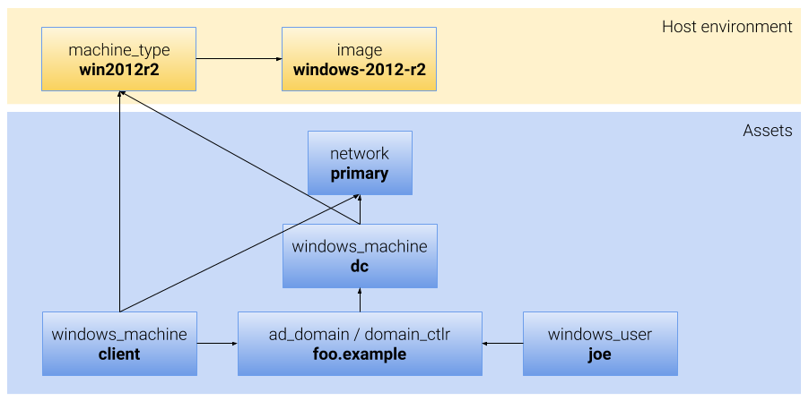

# Automated Lab Deployment

[TOC]

## Objectives

The automated deployment component of the Chrome Enterprise Lab (**CEL**) takes
as input a set of configuration files describing the assets that should comprise
a lab, and automates the deployment of a lab based on that description while
fulfilling the following goals:

The deployment process should …

* … account for user error. Configuration files should be easy to write by
  hand. The tooling should allow users to diagnose and fix errors quickly.

* … be observable, both from the POV of an operator manually triggering the
  deployment, and also from the POV of a service that may provide a secondary UI
  for an in-progress deployment.

* … be observable by an entity that begins observing _after_ the deployment
  process has started.

* … facilitate forensic debugging. Important for deployments that are triggered
  as a part of another automated process.

* … tolerate third party outages. In particular, outages for Github or package
  management repositories like Chocolatey should not cause the enterprise lab to
  become non-functional.

* … tolerate existing infrastructure. It should not be a requirement that each
  deployment be preceded by removing all Google Cloud Platform (**GCP**) assets
  from a project, or start with a new GCP project.

  That goal also implies that deployment is necessarily incremental in that a
  failed deployment can be resumed — within reason — after correcting for the
  factors that caused the initial failure, thus lending itself to edit-deploy
  iterations. It also implies that the deployment process is forgiving of
  hosting environment errors such as transient failures in GCP infrastructure.

* … be amenable to easy addition of new asset types to the asset catalog.

* … be self documenting in terms of asset types, asset catalogs, and builtins.

* … support additional tooling where appropriate. Operators and developers
  should be able to build tools to automate their workflows. In particular, the
  test team should expend reasonable efforts towards building UIs.

* … be atomic much as possible. This means that when deploying a lab into a GCP
  project, the lab toolchain should deploy all required pieces -- within reason
  -- without assistance. Once started, there should be no manual steps.


## Background

It is assumed that the reader is familiar with the general design concepts as
described in the [Design][]. This document supersedes the main design where the
two differ.

The schema for assets and host environment is as described in the design
document and further specified in code ([Asset Description Schema][], [Asset
Schema][], [Host Environment Schema][]).

In addition, the automated deployment phase makes use of the following technologies:

* Google Cloud Storage
  ([Documentation](https://cloud.google.com/storage/docs/)).  Cloud Storage is
  used for communicating files and other resources to instances. Cloud Storage
  buckets aren't created by the lab, but must be specified in the Host
  Environment.

* Google Cloud Deployment Manager
  ([Documentation](https://cloud.google.com/deployment-manager/docs/)). Deploys
  all GCP assets and keeps track of individual deployments. Nomenclature caveat:
  The Deployment Manager refers to deployable things as "resources", while CEL
  calls them "assets." The two terms should be considered equivalent.


## Overview

### The Inputs

Let's start with a quick example where we deploy a single Active Directory
server and a Windows client into a newly minted GCP Project.

Our `ASSET MANIFEST` looks like this:

<!-- INCLUDE ../examples/schema/ad/one-domain.asset.textpb (51 lines) fenced as textpb -->
``` textpb
# Copyright 2017 The Chromium Authors. All rights reserved.
# Use of this source code is governed by a BSD-style license that can be
# found in the LICENSE file.

# The network. There should be at least one. Hosts in the same network can talk
# to each other without any restrictions.
network {
  name: 'primary'
}

# An ActiveDirectory domain.
ad_domain {
  name: 'foo.example'

  # AD Domain Controller. This is regarded as a service that runs on a specific
  # machine. This definition just anchors the AD DS to the machine named 'dc'.
  domain_controller {
    windows_machine: 'dc'
  }
}

# A Windows machine.
windows_machine {
  name: 'dc'
  machine_type: 'win2012r2'
  network_interface { network: 'primary' }
}

# Another Windows machine.
windows_machine {
  name: 'client'
  machine_type: 'win2012r2'
  network_interface { network: 'primary' }

  # This one explicitly lists 'foo.example' as the domain to which this machine
  # belongs. This will result in this machine being automatically joined to
  # 'foo.example' using the default domain administrator credentials.
  container { ad_domain: 'foo.example' }
}

# A Windows user.
windows_user {
  name: 'joe'
  description: 'Joe The User'

  # This is a domain user. The user will not be made a member of any additional
  # groups since there are no member_of entries.
  container { ad_domain: 'foo.example' }
}
```

The `HOST ENVIRONMENT` is:

<!-- INCLUDE ../examples/schema/ad/one-domain.host.textpb (65 lines) fenced as textpb -->
``` textpb
# Copyright 2017 The Chromium Authors. All rights reserved.
# Use of this source code is governed by a BSD-style license that can be
# found in the LICENSE file.


# Google Cloud Platform Project information
project {
  # Name of project
  name: 'my-test-gcp-project'

  # All assets will be created in this zone. The region/location is implicit.
  zone: 'us-east1-b'
}

# Where the logs go.
log_settings { admin_log: "admin" }

# The GCS storage bucket and prefix to use.
storage {
  bucket: "my-test-gcp-bucket",
  prefix: "/cel/test-lab"
}

# We only use one machine type in our examples
machine_type {
  # Name must match the host_machine_type field in the windows_machine asset
  # entries.
  name: 'win2012r2'

  # Going to specify instance properties for a new GCE instance. Alternatively,
  # we could specify a GCE instance template name.
  instance_properties {
    # Go with 2 CPUs and 7.5GB of RAM. This is the GCE machine type, not to be
    # confused with the CEL machine_type.
    machineType: 'n1-standard-2'

    # Scheduling options. By default instances are not pre-emptible.
    scheduling {
      automaticRestart: true
    }

    # Disks. We only need one disk
    disks {
      # ... which is a boot disk. This can be left out since the first disk
      # will become the boot disk by default.
      boot: true

      # This is a special form for referencing the URL property of the image
      # object named windows-2012-r2. Furthermore, this image type is not
      # defined in this file. Instead see the builtins.textpb file for a list
      # of builtin host assets that can be included for convenience.
      source: '${host.image.windows-2012-r2.url}'
    }

    # Note that we are leaving a bunch of fields out because their defaults are
    # reasonable. See the GCE documentation, and in particular the REST API
    # documentation for what these fields do. For our convenience, we generate
    # a .proto file containing the Compute API schema which has the same
    # information. This generated .proto file can be found at
    # /schema/gcp/compute/compute-api.proto.
  }
}

```

The host environment is dependent on the builtin host assets which currently
define image locators for the set of public images supported by GCP.

Assuming that the operator has the correct set of credentials to initiate the
deployment, they could start a deployment using a command-line such as the
following:

``` sh
cel_ctl deploy --builtins assets.textpb hostenv.textpb
```


The `--builtins` argument tells `cel_ctl` to pull in the set of built-in assets.
Without this, the `${host.image.windows-2012-r2.url}` reference will not be
resolved. Built-in assets are defined in [this source
file](../schema/gcp/builtins.textpb).  Builtins may not always be suitable in
cases where the images that are needed for assets are custom or not the latest
public images.

Alright, this is probably a good time to explain what
`${host.image.windows-2012-r2.url}` means…


*** aside
**Quick Aside on References**

Defining an asset hierarchy necessarily involves stating relationships between
assets. This can be done explicitly as is the case with the `windows_machine`
entry for `ad`, or done implicitly as is the case with the `machine_type` entry.

In
the explicit case, the structure of the entity itself demands the nature of the
relationship. For example, the `windows_machine` entry needs to specify a
`network_interface` which in turn needs to state the network to which the
interface is connected. The nature of the dependency can be readily inferred
from context.

In the implicit case, an output of an asset is used as an input
for another asset.

Currently such a dependency relationship is limited to string fields. This is
done by referencing the `OUTPUT` field name from any string field in an asset.
For example, `${host.image.windows-2012-r2.url}` refers to the url output field
of the image resource named `windows-2012-r2` in the host environment. More
details about references can be found in the [Inline References][] section.
Basically an implicit (or inline, if you prefer) reference looks like structure
reference with the only difference being that the field names are allowed to be
[RFC 1035](https://www.ietf.org/rfc/rfc1035.txt) labels.
***

Implicit and explicit references between assets can be used to infer a
dependency relationship between all assets. This is currently the only mechanism
for expressing dependencies between assets though that might change in the
future.


### Parsing And Validation

Now that `cel_ctl` was invoked, it will need to read in the configuration files
and validate their contents. Validation is performed _mostly_ automatically
based on the validation annotations in the schema.

These validation annotations look like this:

``` proto
message ActiveDirectoryDomainController {
  // Name of the domain. Must match the `name` field of an
  // ActiveDirectoryDomain entry.
  string ad_domain = 1 [(common.v).ref = "asset.ad_domain"];
  //…
}
```

The `(common.v).ref` is defining a field option of type `common.v` which is an
[ProtoBuf
extension](https://developers.google.com/protocol-buffers/docs/proto#extensions)
type defined in [schema/common/options.proto](../schema/common/options.proto).
Learn more on how this works at [ProtoBuf Custom
Options](https://developers.google.com/protocol-buffers/docs/proto#customoptions).

This specific annotation declares that the value of the `ad_domain` field of the
`ActiveDirectoryDomainController` message is a named reference to a `ad_domain`
asset. I.e. The value of the `ad_domain` field in this message must match the
`name` field of a `ad_domain` asset.

I.e. Consider the following `ActiveDirectoryDomainController` definition:

``` textproto
ad_domain_controller {
  ad_domain: "mydomain.example.com"
  ...
}
```


It would be valid only if there was an `ActiveDirectoryDomain` that's named
`mydomain` like so:


``` textproto
ad_domain {
  name : "mydomain.example.com"
  ...
}
```


Guided by these annotations, `cel_ctl` reads and ensures that all explicit and
implicit references are sound. If any reference is not resolvable, then the
configuration files are malformed and `cel_ctl` will indicate an error.

Due to inline references that can only be resolved during deployment time, some
aspects of early validation are skipped if the fields involved contain inline
references. See [Inline References][].

### Pruning

Pruning is the process by which assets that are not used during a deployment
process are discarded.

By default the set of assets that are slated for deployment includes everything
in the [ASSET MANIFEST][]. However there may be entries in the [HOST
ENVIRONMENT][] that are not referenced by any asset. Such entries are candidates
for pruning.

In addition, in the future `cel_ctl` should be able to deploy a named subset of
assets in the ASSET MANIFEST. This would allow a user to maintain a large
inventory of assets (i.e. the ASSET INVENTORY) and then selectively deploy a
handful of assets for ad hoc testing purposes.

In our example, the only entities that will be dropped are those that are
included as built-ins but not referenced by any assets. I.e. everything in
[builtins.textpb](../schema/gcp/builtins.textpb) will be removed except the
`image` entry for `windows-2012-r2`.


### The Asset Graph

The result of the pruning process is a trimmed down set of assets that should be
deployed. Implicit and explicit references between these assets and host
environment entities define a dependency relation that can be used to construct
a dependency graph. The only participants of this graph are the entries in the
asset manifest and the host environment. In the case of our example, the graph
would look like the following:



This is where the distinction between the host environment and an asset would
become evident. Everything in the asset manifest (in blue) need to be deployed,
created, configured, or otherwise brought into existence within the lab, while
things in the host environment need to already exist.

In the case of the `image` resource, the `cel_ctl` binary (or equivalent in the
case of an automated deployment) would still need to do additional work to
figure out the URL of the latest image, but the image ultimately has to exist
prior to the deployment.  Hence everything in the host environment (in yellow)
needs to be fully resolved prior to proceeding with the rest of the process.

The relationship of the `ad_domain_controller` to the `ad_domain` and
`windows_machine` resources is a bit special. In reality the `ad_domain` doesn't
really exist until at least one domain controller is operational. In addition,
the domain isn't discoverable until a DNS server publishes the AD and Kerberos
resource records. In most AD deployments, the DNS server deployment is
concurrent with the promotion of a server to a domain controller. Hence the
`ad_domain_controller` entry is folded into the `ad_domain` entry.


### Division Of Labor

Even though the deployable assets are neatly arranged in a graph, we need to do
some more work before we are ready to begin doing real work. The deployer needs
to translate between concepts like `windows_machine` and `network` to things
that the hosting environment understands. In our case, the lab will be hosted in
a GCP project. Some assets such as networks can be constructed entirely within
the GCP, while others like `windows_machine` need to be constructed by GCP but
then configured using our own custom code.

The `cel_ctl` design aims to use the [GCP Deployment
Manager](https://cloud.google.com/deployment-manager/) for doing most of the
work of creating and updating supported assets, or _resources_ in Deployment
Manager nomenclature. The list of resource types that are currently supported by
the Deployment Manager can be found
[here](https://cloud.google.com/deployment-manager/docs/configuration/supported-resource-types).

Once the base images are instantiated by the Deployment Manager, the instance
startup scripts can take over the additional work of configuring the machine. To
this end, `cel_ctl` needs to determine the split between the work that's to be
assigned to the Deployment Manager and the work that is to be assigned to
per-instance startup scripts.

Therefore, for each asset that must be deployed, we need to determine:


* **Who** deploys it: Deployment Manager, or a specific Instance, or both. Some
  resources like `windows_machine` as mentioned above will be split across DM
  and the Instance since they involve deploying a GCP resource as well as doing
  instance configuration.

  All host environment entities are resolved by the deployer at the time of
  deployment. Hence the host environment is not a part of the deployment plan.

* **When** is it deployed: This only applies to assets that need to be deployed
  from within an instance. _When_ is a function of the dependencies of the
  asset. Deployment of an asset must wait until its dependent assets are ready.

Conceptually, the deployment graph can be adjusted to indicate the division of
deployment responsibility thusly:


The assets that need to be resolved on a VM instance (coloured blue in the
diagram) need to be assigned to a specific VM instance at deployment time. This
is done by `cel_ctl` using a relatively stable matching process in case that
asset can be resolved on more than one instance.

Notice that in the above diagram, `windows_machine` has been split into two in
order to make it obvious that one part of the machine deployment is handled by
the GCP Deployment Manager while the other part is handled by the instance
initialization. In practice, `cel_ctl` doesn't treat `windows_machine` as two
different assets. Instead an asset can be handled by multiple handlers at
different phases.

Also note the dependency ordering between deployment logic handled by `cel_ctl`,
what's handled by the Deployment Manager and what's resolved during instance
configuration. As the diagram indicates the sequence of deployment and also
dependencies flow from the top to the bottom. Dependency ordering violations
including cycles are detected during the [Asset Validation](#asset-validation)
phase.


### Preparation Stage

Once the division of labor has been established, it is now time to start laying
out the deployment plan. The deployer now visits the assets in topological order
in multiple phases as described below and invokes "resolvers" on each asset in
topological order.

*** note
Note that this stage does not make any material change to the GCP projects. This
stage is only concerned with organizing the deployment based on the asset
manifest and the host environment.
***


*** aside
**What's a Resolver?**

Glad you asked. A resolver is something that takes a single asset description as
input, and does whatever it needs to deploy, verify the existence and
configuration of, or gather information for constructing the asset.

Exactly how a specific resolver does its thing depend on who does the resolving
and when the work is done. These variations are what distinguishes each type of
resolver.

As an example, the immediate resolver for an Image resource (i.e. resources
specified under host.image) may resolve the resource by looking up the URL for
the latest image for a specific GCP project and GCE image family. As another
example, the resolver for a FileReference resource may resolve by uploading the
contents of the file to Object Storage and acquiring an object reference.
***


##### Host Environment Resolution Phase

Used for querying host environment properties.

The resolvers invoked in this phase are referred to as **_Immediate Resolvers_**
in the [Coding Patterns for Resolvers][] section. The deployer nor the resolvers
are expected to many any changes to the environment during this phase since it's
primarily intended to discover properties of the host environment.

Resolvers will query the GCP environment and determine the state and properties
of the resource. Examples include determining the URL of an `image` resource
based on a `project` and `family`, or looking up ranges of reserved external IP
addresses.

In our example, the immediate resolver does the following:

* Query properties for GCP project `my-test-gcp-project`.
* Query image URL for GCP project `windows-cloud` and image family
  `windows-2012-r2`.
* Query properties for log sink `admin`.

##### Deployment Manifest Generation

This phase involves all assets that must be **constructed** in GCP. These are
assets that are considered to be owned by the lab, and hence the CEL toolchain
controls the lifetime and configuration of these assets.

For each such asset, the deployer invokes a resolver type called Manifest
Generator (described in the [Coding Patterns for Resolvers][] section). These
resolvers are expected to generate deployment manifest resource descriptions for
each asset that must be created.


An example configuration can be found in the [Deployment Manager
documentation](https://cloud.google.com/deployment-manager/docs/configuration/create-basic-configuration),
and looks like this:


``` yaml
## Copyright 2016 Google Inc. All rights reserved.
##
## Licensed under the Apache License, Version 2.0 (the "License");
## you may not use this file except in compliance with the License.
## You may obtain a copy of the License at
##
##     http://www.apache.org/licenses/LICENSE-2.0
##
## Unless required by applicable law or agreed to in writing, software
## distributed under the License is distributed on an "AS IS" BASIS,
## WITHOUT WARRANTIES OR CONDITIONS OF ANY KIND, either express or implied.
## See the License for the specific language governing permissions and
## limitations under the License.

resources:
- name: vm-created-by-deployment-manager
  type: compute.v1.instance
  properties:
    zone: us-central1-a
    machineType: zones/us-central1-a/machineTypes/n1-standard-1
    disks:
    - deviceName: boot
      type: PERSISTENT
      boot: true
      autoDelete: true
      initializeParams:
        sourceImage: projects/debian-cloud/global/images/family/debian-8
    networkInterfaces:
    - network: global/networks/default
```


Thus each asset visited by the resolver will result in one or more "resources"
being added to the deployment configuration. Later during the deployment
process, this list can be used to generate the overall YAML formatted
configuration that is then used to create a GCP Deployment Manager
**Deployment**
([documentation](https://cloud.google.com/deployment-manager/docs/deployments/)).

The Deployment thus created is persistent, and can be used to (for example):


*   Preview what would be deployed.
*   Track progress of the ongoing deployment, including handling cancellations.
*   Update and re-deploy when making incremental changes.
*   Dump the deployment manifest containing the full deployment details.
*   Delete the whole deployment when we are done.

The deployment configuration that would be generated for our example would be:

``` yaml
resources:
  - name: my-test-gcp-project
    type: cloudresourcemanager.v1.project

  - name: instance-service-account
    type: iam.v1.serviceAccount
    properties:
      accountId: instance-service-account
      serviceAccount:
        projectId: $(ref.my-test-gcp-project.projectId)

  - name: primary
    type: compute.v1.network
    properties:
      IPv4Range: 10.1.1.0/24
      routingConfig:
        routingMode: REGIONAL

  - name: ad
    type: compute.v1.instance
    properties:
      machineType: zones/us-central1-a/machineTypes/n1-standard-2
      scheduling:
        automaticRestart: true
      disks:
        boot: true
        source: #resolved URL
      networkInterfaces:
        - accessConfigs:
          - name: External NAT
            type: ONE_TO_ONE_NAT
          network: $(ref.primary.selfLink)
      serviceAccounts:
        - email: $(ref.instance-service-account.serviceAccount.email)
      metadata:
        items:
        - key: windows-startup-script-ps1
          Value: <<placeholder.cel-startup-ps1>>

  - name: client
    type: compute.v1.instance
    properties:
      machineType: zones/us-central1-a/machineTypes/n1-standard-2
      scheduling:
        automaticRestart: true
      disks:
        boot: true
        source: #resolved URL
      networkInterfaces:
        - accessConfigs:
          - name: External NAT
            type: ONE_TO_ONE_NAT
          network: $(ref.primary.selfLink)
      serviceAccounts:
        - email: $(ref.instance-service-account.serviceAccount.email)
      metadata:
        items:
        - key: windows-startup-script-ps1
          Value: <<placeholder.cel-startup-ps1>>
```


In addition to the assets that were explicitly mentioned in the manifest, the
deployment process adds dependent assets like service accounts and project
references. Astute readers will spot a few caveats of mapping the CEL schema to
Deployment Manager configuration. These are addressed in the [Use of GCP
Deployment Manager](#use-of-gcp-deployment-manager) section.

Field values that haven't been resolved yet are represented by the
`<<placeholder.cel-start-ps1>>` type values. These will be filled in during the
[Execution](#execution) phase once the startup scripts are uploaded. Note that
the `<<foo>>` syntax is just for documentation purposes and not indicative of
how placeholders are implemented.


##### Instance Configuration Generation Phase

During this phase the deployer determines the configuration information that
must be made available to each of the VM instances. The resolver invoked during
this phase is called _Configuration Generator_ in the [Coding Patterns for
Resolvers][] section.

This resolver visits each asset that must be constructed, provisioned, or
configured within the lab and:


* Assigns the asset to a VM instance. This instance is called the **_host_** for
  the asset. Conversely the asset is a **_tenant_** of the instance. Thus the
  instance configuration scripts on this host are responsible for ensuring the
  existence and correctness of this asset. The choice of host is pretty obvious
  for assets that are explicitly bound to an instance (e.g. a service that runs
  on a specific machine), but isn't quite obvious for non-instance bound assets
  (AD Domain Users).

* Ensures that the VM instance's configuration inherits instance dependencies as
  requirements for hosting its tenant assets. For example, hosting a website
  implies that the host have the `Web-Server` feature.

* Identifies external resources that must be copied over to the target VM
  instance. For example, an instance hosting a website needs the files that
  collectively define the website.

In our example, the following configuration steps need to happen on each instance:


*   **«ad»**
    *   CEL Windows instance setup. See [Windows Instances](#windows-instances).
    *   Installing domain controller for `foo.example` domain.
    *   Creating AD domain user `joe`.
*   **«client»**
    *   CEL Windows instance setup.
    *   Join AD domain `foo.example`.

On-instance configuration typically relies on on the Completed Asset Manifest.
The latter won't be available at this point of the deployment process, but will
be uploaded during the **Execution** stage below.


### Execution Stage

At this point the deployer has the Deployment Manager configuration, and the
instance configuration prerequisites are in place.

The next steps are:

*   [GCP Prep Phase](#gcp-prep-phase).
*   [Deployment Manager Invocation Phase](#deployment-manager-invocation-phase).
*   [Instance Configuration Phase](#instance-configuration-phase).

##### GCP Prep Phase

Prior to launching anything, the deployer needs to make sure that global
resources and metadata required for the lab are up-to-date. Thus the deployer:


* **Constructs a new Generation ID for this deployment**. This is akin to the ID
  of the deployment that will be created later, but is one that is created by
  `cel_ctl` prior to invoking the GCP Deployment Manager. The Generation ID is
  unique even across deployments and uniquely identifies this specific
  deployment attempt. The Generation ID must also be updated in the Completed
  Asset Manifest.

  Currently the Generation ID is a 128-bit random number expressed as a
  lowercase hex string. E.g. `e8d53a36e8d08bdba2551365d5a1db67`.

* **Deletes obsolete deployments**. This step is only necessary if there are
  existing deployments in the GCP project other than the one used by CEL. CEL
  only supports one active deployment per GCP project. This is a destructive
  operation and one that should only be performed by `cel_ctl` with user
  confirmation.

* **Stops all running VM instances**. This is a hard stop and is necessary
  because instance configuration changes cannot be applied while an instance is
  running. Obviously only applies to instances that still exist after the
  obsolete deployments were removed.

  This step also implicitly stops any instance configuration steps that may have
  been running from a recent incomplete deployment.

* **Creates or verifies VM instance service account**. The service accounts are
  required for setting up proper ACLs. The following service accounts are
  required:

  * `cel-instance-service` (See [Service Account](#service-account)).

* **Creates or verifies Google Cloud KMS CryptoKeys**. Key management requires
  the following CryptoKey to be present:

  * `cel-manifest-key` (See `cel-manifest-key` in [Key Management][]).

* **Uploads Instance Scripts and Binaries to Object Storage.**
  * **Uploads the CEL startup scripts to Object Storage**. For windows, this is
    a set of PowerShell scripts.

  * **Uploads the CEL_Agent binary**. This compiled binary handles part of the
    on-host configuration.

* **Resolves Secrets**. This encrypts and stores secrets using the CryptoKey
  `cel-manifest-key`. The deployer stores the resulting ciphertext in Object
  Storage and writes the resulting storage reference into the Completed Asset
  Manifest.

* **Resolves FileReferences**. The deployer reads in files and folders that are
  required for instance configuration and stores them in Object Storage. It also
  updates the resulting storage reference in the Completed Asset Manifest.

* **Uploads [Completed Asset Manifest](#completed-asset-manifest) to Object
  Storage**. There should be no unresolved `OUTPUT` type resources after
  `Secret` objects and `FileReference` objects are resolved.

* **Constructs new GCP Deployment Manager Runtime Configuration for this
  deployment**. Currently there should be at most one active Runtime
  Configuration per GCP project. We don't and don't plan on supporting multiple
  deployments in a single project. See [Runtime Configuration
  documentation](https://cloud.google.com/deployment-manager/runtime-configurator/create-and-delete-runtimeconfig-resources)
  in GCP.

  The Runtime Configuration shall be named `cel-runtime`.

  If the Runtime Configuration already exists, it should be purged of all its
  values. Otherwise the new deployment may use stale data from a prior
  deployment.

* **Updates project scoped metadata**.

  * `cel-manifest` ← reference to Completed Asset Manifest.

  * `cel-agent` ← JSON object mapping the string `$GOOS_$GOARCH` to the
    corresponding reference to the uploaded CEL agent binary. E.g.

    ``` json
    { "windows_amd64": "gs://my-test-project-bucket/cel/objects/f810e00210b",
      "windows_386": "gs://my-test-project-bucket/cel/objects/e289537b42f"}
    ```

  * `cel-admin-log` ← Name of Stackdriver log to use for administrative messages
    during deployment.

    Log settings are a part of the Completed Asset Manifest as well, but it's
    exposed as a separate entry so that entities in the lab can correctly
    configure logging without having to parse the entire manifest.

* **Resolves placeholders in deployment manifest**. If there are any
  `<<placeholder.*>>` strings in the deployment manifest, these can all be
  resolved at this point.


##### Deployment Manager Invocation Phase

The Deployment Manager resources should now be complete and void of
`$(placeholder.*)` entries. `cel_ctl` can serialize the YAML formatted
configuration and construct or update the deployment.

It should be possible for `cel_ctl` to upload a deployment in `preview` mode
([Documentation](https://cloud.google.com/deployment-manager/docs/configuration/preview-configuration-file))
so that an operator can examine what the lab deployment will do prior to doing
the work. Even when previewing, the GCP Prep phase cannot be avoided, and
previewing one deployment while another is active in the GCP project is not
currently supported.

If a deployment is created in `preview` mode, issuing an `update` command to the
deployment should be the equivalent of creating a deployment with `preview` set
to `false`. I.e. resuming the deployment in preview should continue the
deployment.


##### Instance Configuration Phase

Each instance that is brought up after provisioning via the Deployment Manager
should immediately be able to locate and fetch its per-instance configuration
settings. The instance startup scripts ensure that the latest CEL_Agent along
with the completed asset manifests and any external data required for
configuring the current instance is available.

As detailed in the Windows Instance section, dependencies on services that cross
machine boundaries are resolved via the GCP Runtime Configurator API which gives
us fine grained details on the state of all the assets in the lab. This
information along with the streaming logs should allow any entity to observe the
deployment as long as they have the appropriate permissions.

See the [Windows Instances](#windows-instances) section for more details on how
a Windows VM instance startup and configuration is performed.


### Wrapping Up

Once the GCP Deployment Manager finishes deploying all GCP resources, and once
all instances report that their per-instance configuration tasks are complete,
lab deployment is done.

The lab is now ready for use.


## Detailed Design


### Foundation Services

The deployment process, once launched, needs to be self sustaining. Hence all
the required infrastructure for managing communication and coordination should
be deployed by the deployment process prior to them being needed. The set of
services that the DEPLOYER is going to depend on are as follows:


*   **[Object Storage](#object-storage)** (Content Addressed): Stores large
    objects like files that need to be installed onto lab machines, and
    configuration blobs. \

*   **[Runtime Configuration](#runtime-configuration)**: Stores hierarchical
    metadata and provides mechanisms for waiting for state changes. \

*   **[Logging](#logging)**: An abstract mechanisms where log information is
*   generated and aggregated across the entire lab. \

*   **[Key Management][]**: Some objects need to be encrypted
    during transit. The Key Management service is used for controlling access to
    who can encrypt and decrypt objects. Needed for privilege separation within
    the lab.

These topics are covered below after a few more prerequisites are explained.

### Internal References (a.k.a. Inline References)          {#inline-references}

Assets sometimes need to refer to properties of other assets. These
relationships are represented in the `textpb` files using internal or inline
references. Since these references need to refer to specific assets, there needs
to be a way to uniquely address each asset.

This addressing scheme is based on **_Reference Paths_**, which are a sequence
of labels identifying the path to a resource from the root of the combined asset
and host environment namespace. Assets always start with the label `asset`,
while host environment entities always start with the label `host`.

When traversing a collection of named objects (e.g. traversing a repeated field
in a Protobuf Message like `repeated WindowsMachine windows_machine`), the name
of the target object is used as the label.

E.g.: a `WindowsMachine` asset named `ad` would have a reference path of
`['asset', 'windows_machine', 'ad'][]`.

For convenience, reference paths are written as a string with labels separated
by `.`. I.e. Equivalent to the Python expression `'.'.join(['asset',
'windows_machine', 'ad']`

E.g. The same reference path mentioned above would be written as
`asset.windows_machine.ad`.

Following the same scheme, a property of an asset can be referred to using the
field name as the label.

E.g. The `fqdn` field of a `windows_machine` asset named `ad` would have the
reference path `asset.windows_machine.ad.fqdn`.


When used in a string field to refer to another string value, a reference is
encoded as `${<refpath>}` where `<refpath>` is the reference path joined
together using `.`.

One caveat here is that some components may include periods. In such cases,
those components are further enclosed in `()`. For example, an AD domain named
`foo.example` will have string reference of `${asset.ad_domain.(foo.example)}`.
This parenthesis rule follows the conventions of ProtoBuf references.

E.g. the `netbios_name` property of the `foo.example` domain would be
`${asset.ad_domain.(foo.example).netbios_name}`.

The Validation phase ensures that any string references encountered in the
configuration refers to a valid asset or a string field. Currently only string
fields can appear as the target of an inline reference.

Logic for storing and manipulating reference paths can be found in
[ref_path.go](../go/common/ref_path.go).  Code for generating and resolving
references with asset and host manifests can be found at
[namespace.go](../go/common/namespace.go).


### Object Storage

Implemented using Google Cloud Storage
([Documentation](https://cloud.google.com/storage/docs/)). GCS is special in
that the storage bucket namespace isn't local to a GCP project. Hence the Host
Environment needs to specify the GCP bucket to use. CEL does not attempt to
create the bucket either. It must already exist.


*** note
**Note**: We should consider creating GCS buckets on demand. This would allow
CEL to also control the location of the GCS bucket which should correspond to
the zone/region configured in the Host Environment.
***

GCS isn't hierarchical. Instead it gives the appearance of hierarchy using name
prefixes. We'll build on top of this by isolating a lab's storage space into a
prefix delimited namespace for storing content addressed objects. This would
allow a single GCS bucket to support multiple CEL deployments.

E.g. A GCS path prefix such as `gs://my-test-gcp-bucket/some-lab-01` identifies
not only a GCS bucket (`my-test-gcp-bucket`), but also a namespace prefix for
objects (`some-lab-01`).

This GCS path prefix is specified in the Host Environment
([source](../schema/host/host_environment.proto)) using the `Storage` message.
If no prefix is specified, the default prefix is `cel-config`.

Storing a blob object in our Object Storage service involves:

* Construct a SHA-256 digest of the content.
* Construct the name as `namespace-prefix + "/o/" + hex-encoded-digest` where
  `namespace-prefix` would be the prefix from the Host Environment, and
  `hex-encoded-digest` is the hex encoded SHA-256 digest of the content.
* If an object by that name exists, then there's nothing to do. Otherwise
  store the object with that name.

This results in an object with a name like
`gs://my-test-gcp-bucket/some-lab-01/o/0edfd414c0ea0c7e8ff93433673ddf810e00210b`,
which will become the object reference for the stored object.

If the final "path" component is significant, then an additional name component
or an extension can be appended to the object name. E.g. If the object name must
end with the extension `.ps1`, then that extension can be appended to the name.
The resulting GCS path to the object would be, for example,
`gs://my-test-gcp-bucket/some-lab-01/o/0edfd414c0ea0c7e8ff93433673ddf810e00210b.ps1`

While object references are GCS paths, any component that receives an object
reference should treat it as opaque. The only exception is the API for resolving
object references, which obviously needs to know how to fetch the object
corresponding to the reference.


##### Permissions

* The credentials used for running `cel_ctl` needs the following GCS permissions:
  * `storage.objects.create`
  * `storage.objects.list`
  * `storage.objects.getIamPolicy`
  * `storage.objects.setIamPolicy`

* The lab instance service account needs read access to the GCS bucket. I.e.
  * `storage.objects.get`


##### Lifetime

Object Storage only needs to hold objects for a single generation of the lab
because each new deployment ensures that the required objects are present.

Hence, a Google Cloud Storage bucket that's providing backing storage for the
Object Storage service could be safely configured to delete objects that are
older than some predefined age. Operators should pick an age that exceeds the
expected lifetime of the lab.

In addition, when deleting a lab, all of its associated storage can also be
safely deleted.


##### Choice Of Hash Function

Initially the hash function will be SHA-384. Thus [subresource
integrity](https://www.w3.org/TR/SRI/) strings generated for stored objects are
also based on a SHA-384 digest.

However, nothing in the API should rely on a specific choice of digest. There's
no compatibility risk here since the object name is only meant to be meaningful
to a single generation of the lab.

*** aside
**Why Content Addressed Storage?**

Use of content addressed storage …

* … makes it easier to avoid storing the same object twice if the content hasn't changed.

* … immutable references avoid the need to deal with version skew across references.

The downside of this scheme is the need for garbage collection. Since objects
are restricted to a namespace, we can simply remove all objects within that
namespace when a lab instance needs to be discarded.
***


### File Resources

When an asset depends on a file or a folder, the asset schema allows specifying
that dependency using a `FileReference` message which looks like this:

<!-- INCLUDE ../schema/common/file_reference.proto (88 lines) fenced as proto -->
``` proto
// Copyright 2017 The Chromium Authors. All rights reserved.
// Use of this source code is governed by a BSD-style license that can be
// found in the LICENSE file.

syntax = "proto3";
package common;
option go_package = "chromium.googlesource.com/enterprise/cel/go/common";

import "schema/common/validation.proto";

// A file reference. Use this when the configuration should refer to a file or
// a directory that's specified as part of the configuration. All such paths
// are resolved *relative to the source file* in which the reference appears.
message FileReference {
  // Path relative to the location of the .textpb file in which the reference
  // appears. Absolute paths are not allowed.
  //
  //   * Path separators are always forward slashes.
  //   * No parent directory traversal. I.e. ".." is an invalid path component.
  //   * '.' is a valid component, but you might as well leave it out.
  //   * The referenced path must exist.
  //
  // This, of course, means that textpb files that refer to other files should
  // live higher up in the directory tree or live beside the relevant files.
  //
  // Note: This field is only valid during authoring. It is cleared when
  // constructing the Completed Asset Manifest.
  string source = 1 [(v).type = REQUIRED];

  // The path where the target of this FileReference should be copied to on the
  // target machine. This field is optional and is only meaningful when a file
  // or directory should be placed in a specific location on a machine. The
  // machine is implied based on the schema containing the FileReference.
  //
  // The containing schema also determines how the contents of the
  // FileReference is treated. In cases where the local path doesn't matter
  // then an indeterminate temporary path may be used.
  //
  // Must be a full path or empty.
  string target_path = 2;

  // The full path to file or directory contents being referred.
  //
  // During authoring the deployer sets this field to the full path to the
  // source.
  //
  // Within the lab, this field is used to store the full path to the location
  // where the referred files or directories are stored on the local file
  // system. This could be the same as target_path if the latter was not empty
  // and valid.
  string full_path = 3 [(v).type = OUTPUT];

  // Opaque reference to an accessible location where the contents of the file
  // or folder could be found. For GCP, this would be a Google Cloud Storage
  // URL.
  //
  // This reference is understood by the ObjectStorage service.
  string object_reference = 4 [(v).type = OUTPUT];

  // Subresource integrity string.
  //
  // This string is required for all deployed objects. On the client side, the
  // object is rejected if the integrity check fails. Currently only SHA-256
  // digests are supported.
  //
  // See https://w3c.github.io/webappsec-subresource-integrity/
  string integrity = 5 [(v).type = OUTPUT];

  // Type of object.
  enum Type {
    UNDEFINED = 0;

    // A regular file. The object referenced by object_reference contains the
    // contents of the file.
    FILE = 1;

    // A directory tree. The object referenced by object_reference is a Zipped
    // archive which must be expanded at the location specified by target_path.
    // All paths in the Zip files are considered to be relative to target_path.
    //
    // In the event that target_path is not specified, the archive contents are
    // expanded to a location determined based on the integrity string.
    ZIP_ARCHIVE = 2;
  }
  Type resolved_type = 6 [(v).type = OUTPUT];
}
```

The `source` field could refer to a file or a directory.

In the former case we can simply upload the contents of the file as a object to
Object Storage and then stick the resulting object reference in the
`object_reference` field and set type `resolved_type` field to `FILE`.

In the latter case (i.e. uploading an entire directory tree), we construct a
Zip archive containing all the files in the directory tree, upload the zip file
to Object storage, and then stick the resulting object reference in the
`object_reference` field. The `resolved_type` is then set to `ZIP_ARCHIVE`.

### Runtime Configuration

Based on the Runtime Configurator support in GCP [documented
here](https://cloud.google.com/deployment-manager/runtime-configurator/create-and-delete-runtimeconfig-resources).
The basic concepts applicable to CEL are:

* `RuntimeConfig` (the name given to a single set of configuration settings)
  objects are named. A GCP project hosting a CEL deployment contains exactly one
  `RuntimeConfig` and it is named `cel-config`.

* Every top level asset has a namespace in the `RuntimeConfig` corresponding
  to its Reference Path (see [Inline References][] below).

  E.g. a `WindowsMachine` asset with the name `ad` has the namespace
  `asset/windows_machine/ad`. The name components follow the path components for
  its Reference Path.

* Every asset has a `status` variable on the top level of the namespace which
  is one of `init`, `in-progress`, `ready`, or  `error`. In order, these mean
  that the associated resource is in its initial state (e.g. not deployed yet),
  in the process of being deployed, completed deploying, or there was some sort
  of error during deployment.

  E.g. The status of the `WindowsMachine` named `ad` is in the variable named
  `asset/windows_machine/ad/status`.

* All other `RUNTIME` fields contained have corresponding variables. For
  example, the `addresses` runtime field of a `WindowsMachine` named `ad` is in
  the variable named `asset/windows_machine/ad/addresses`.

  Due to restrictions on the hierarchy and naming of variables, once we create a
  variable named `foo/bar/baz`, we can't store anything in a variable named
  `foo/bar`. Therefore, `RUNTIME` fields can only be defined in top-level
  assets.

The Runtime Configuration API allows for watching and waiting for changes to a
variable. (Watching is [documented
here](https://cloud.google.com/deployment-manager/runtime-configurator/watching-a-variable).
Waiting is [documented
here](https://cloud.google.com/deployment-manager/runtime-configurator/creating-a-waiter)).
When a configuration step requires waiting for one or more other assets to
complete, they can wait for the `status` variable corresponding to those assets
to switch to either `ready` or `error`.

One caveat with the API is that watching a variable is restricted to 60 seconds
at a time after which we'd need to issue another watch request.


*** note
**Note**: It is possible that the Runtime Configurator API doesn't give us the
performance characteristics we'd like.

If there's too much latency between a variable being updated and watchers being
notified we may need to consider switching over to Pub/Sub + Cloud Datastore
based approach. This latency can be measured by adding log entries at the time
the variable is updated and when the variable change is observed.
***


### Logging

Logging from CEL deployment and from within labs is done using the Stackdriver
Logging API ([Documentation](https://cloud.google.com/logging/docs/)).

`cel_ctl` and instances use the log named in the Host Environment under the
`log_settings.admin_log` field ([Host Environment Schema][]).  Stackdriver
differentiates between sources, so logs generated on different instances can
easily be differentiated.

For the sake of generality, we will use a consistent format for the log entries
where every entry contains a `gid` specifying the Generation ID of the last
loaded configuration. An unknown generation ID can be represented using `0`
since that is not a valid ID.


### Key Management

See the [Key Management][] document.


### Validation                                               {#asset-validation}

<span style="color:#980000;">Skipping this part. Please comment if this needs to be expanded.</span>

### Service Account                                           {#service-account}

All VM instances in a lab use the same IAM service account. This account is
distinct from the default GCE instance service account to prevent accidental
misconfiguration on projects that are also being handled manually.

The name of the service account is `cel-instance-service`. The full address of
the account will depend on the project name and is determined at runtime.


### Completed Asset Manifest                         {#completed-asset-manifest}

A "Completed Asset Manifest" is the combined asset manifest with all the
`OUTPUT` fields filled in.

The `OUTPUT` fields are those that can be filled in when an asset is resolved.
Compare these with `RUNTIME` fields which may be determined after the asset is
resolved and is active. E.g. the IP address of an instance is considered a
`RUNTIME` field, while the URL of an `Image` is determined during deployment and
is considered an `OUTPUT` field.

Hence all the `OUTPUT` fields can be determined at deployment time, and can be
filled in in the manifest. The resulting manifest data is encoded as a `textpb`
and stored in the Object Storage. The reference to the storage is stored in the
project metadata. The choice for the encoding of the manifest is arbitrary since
we control both the encoding and decoding logic, but `textpb` makes it easy to
diagnose what's going on and is easier on the eyes compared to JSON or binary.


### Coding Patterns For Resolvers               {#coding-patterns-for-resolvers}

A Resolver is something that can visit relevant assets and do whatever is
necessary to get that asset into a _"resolved"_ state. The actual meaning of
_"resolved"_ depends on what kind of resolution is being done. For example, an
immediate resolver is something that will attempt to query GCP and determine if
the corresponding resource exists, and if so, query all relevant properties. A
Manifest Generator, on the other hand, just emits snippets of resource
configuration that is needed by the GCP Deployment Manager to construct the
asset later.

Internally, the `cel` codebase uses ProtoBufs to define the asset schema. The
`proto` files that define the schema are also used to generate Go code. Each
asset type results in a Go type generated that looks like this:

``` go
// A Windows machine.
type WindowsMachine struct {
   // Elided
}

func (m *WindowsMachine) Reset()                    { /* */ }
func (m *WindowsMachine) String() string            { /* */ }
func (*WindowsMachine) ProtoMessage()               { /* */ }
func (*WindowsMachine) Descriptor() ([]byte, []int) { /* */ }
```

Together, each Go type thus generated implements the `proto.Message` interface
(where `proto` refers to `github.com/golang/protobuf/proto`, and `Message` is
defined
[here](https://github.com/golang/protobuf/blob/master/proto/lib.go#L277)). Hence
the entire hierarchy of assets and host environment entities can be thought of
as a graph of `proto.Message` objects. Therefore a topological traversal of the
asset graph is, in effect, a topological traversal of `proto.Message` objects.

During initialization, resolvers of different types can register themselves as
such using a syntax similar to the following:

``` go
// ImmediateResolver is a strawman resolver for assets that can be fully resolved
// at deployment time.
type ImmediateResolver interface {
        ResolveImmediate(m *proto.Message, s *gcp.Session) error
}

// ImageResolver is an ImmediateResolver for CEL image types. The CEL Images are
// resolved against GCP public or private images based on the Host Environment.
type ImageResolver struct {
}

func (i *ImageResolver) ResolveImmediate(m *proto.Message, s *gcp.Session) error {}

func registerResolvers(r *ResolverRegistry) {
        r.Register(&host.Image{},
                   *((*ImmediateResolver)(nil)),
                   &ImageResolver{})
}
```


The assets support a topological visit function which asserts that when visiting
asset A, all assets that A depends on have been visited successfully. As
implied, any asset that depends on A will not be visited until A's visit has
been successfully completed.


``` go
// ResolveAssets invokes |f| on each asset in |A| such that the following holds:
//   If A depends on B, then f(A) will be called only after f(B) has returned
//       successfully.
//   If A depends on B, and f(B) returns a non-nil error, then f(A) will not be
//       called.
func ResolveAssets(A *Assets, f func(m *proto.Message) error) error {}
```


Combined with `ResolveAssets`, we can invoke a specific type of resolver over
all assets in topological order like this:


``` go
ResolveAssets(A, func(m *proto.Message) error {
  resolver, ok := r.Lookup(m, *((*ImmediateResolver)(nil)))
  if !ok {
    return nil
  }
  return resolver.(ImmediateResolver).ResolveImmediate(m, s)
})
```


### Use Of GCP Deployment Manager               {#use-of-gcp-deployment-manager}

The Google Cloud Deployment Manager is [documented
here](https://cloud.google.com/deployment-manager/docs/). It can be used to
manage the deployment of a collection of a growing inventory of resources.

CEL uses it as middleware for deploying supported GCP assets. Without this, CEL
would need to manually deploy each GCP asset individually. Instead CEL can now
generate a Deployment Configuration and push it out without further oversight.

In addition to what's covered in the Deployment Manager, the quirks as
applicable to Chrome Enterprise Lab are:

* **No colons in project ID**. This is a bit surprising, and is internally
  tracked as a bug. Bug essentially, the project ID cannot have a colon. This
  excludes projects that are created within an organization since such projects
  will look like `organization.org:project-name`.

* **Limit of one deployment per GCP project**. While Deployment Manager
  supports multiple deployments within a single GCP project, this
  functionality is not currently considered to be useful for the CEL use case.
  In addition, the use of project level metadata to guide the deployment and
  configuration of assets within the project imply that only a single CEL
  deployment can exist within a single project.

  Since only one deployment is possible, we can give it a well known name like
  `cel-deploy`. Having a consistent name means that edit-deploy cycles can make
  use of the `UPDATE` functionality in a Deployment Manager ([documented
  here](https://cloud.google.com/deployment-manager/docs/deployments/updating-deployments))
  to minimize the work that needs to be done.

* **Creating the DM deployment has to be the last step of a CEL deployment**.
  This ensures that once the Deployment Manager is invoked, we can use the GCP
  UI to oversee and manage the deployment if necessary including previewing and
  debugging. The CEL toolchain is thus constructing cloud deployment and
  allowing the GCP logic to take over.


### Windows Instances                                       {#windows-instances}

Windows VMs running inside the lab are considered to be based on vanilla public
images. Custom images should ensure that the GCE Windows Agent is installed and
functional at a minimum and is able to run instance startup scripts as specified
by GCE.

Every instance has:

* A GCP IAM service account. All instances share the `cel-instance-service`
  account.
* Local configuration.
* A startup script.


#### Local Configuration

Local configuration information for a Windows VM instance is kept in the
registry key under `HKLM\Software\CEL`. Typically the stored values are
mapping from a well known string to a JSON blob. I.e. data type is `REG_SZ`.


#### Startup Script

Instance startup is handled primarily by the [GCE Windows
agent](https://github.com/GoogleCloudPlatform/compute-image-windows), a CEL
specific Windows PowerShell instance startup script, and then by the CEL agent
as started by the script.

The PowerShell script is responsible for the following:

1. Lookup `cel-admin-log` project metadata via `Invoke-RestMethod`. This is the
   name of the log to use during startup script execution. Log entries can be
   added, once again, via `Invoke-RestMethod`.

1. Log an entry indicating that the startup script is executing. All metadata
   that's looked up must be recorded in the log. For clarity, logging is elided
   from the rest of this description.

1. Download and register the CEL agent binary.
   1.  Lookup `cel-agent` project metadata via `Invoke-RestMethod`. The
       resulting dictionary has keys for `<goos>-<goarch>` corresponding to
       current platform.
   1.  Lookup the GCS path for the CEL agent binary corresponding to current
       platform.
   1.  Lookup GCS path for installed `cel-agent` in local configuration under
       `cel-agent`. If the paths match, then skip CEL agent installation.
   1.  Calculate the SHA256 hash of the binary using `Get-FileHash`. The hex
       encoding of the digest should match the last component of the GCS path.
   1.  Use `gsutil` to copy the CEL agent binary to
       `C:\CEL\agent\<sha256-hash>\cel_agent.exe`.
   1.  Invoke `cel_agent.exe --install` which will remove the existing service
       registration if there was one, and will install the current version.
   1.  Write the GCS path of the downloaded binary to `cel-agent` value under
       local configuration.

1. Synchronize time if necessary setting the time server to `time.google.com`.

1. At this point the `CelAgent` service should be installed. Start the service
   if it isn't already running. The rest of the configuration will be guided by
   the `cel_agent` binary.


#### CEL Agent (Windows)

The CEL Agent is a Go program that's compiled and installed as a Windows service
running under the LocalSystem account. It is responsible for publishing status
updates to the PubSub topic during instance startup as well as listening for
control events under the instance's control topic.

The CEL agent performs the following tasks on startup. Note all steps are to be
implemented in an idempotent manner. It should be cheap to run through the steps
if the work has already been done previously.


1. Look up `cel-manifest` in project metadata. This is the GCP path the
   Completed Asset Manifest.

1. Download and parse the Completed Asset Manifest.

1. Log an entry indicating that the per-instance configuration is starting.

1. Publish the `status` variable with a value of `in-progress`. Note that the
   status prior to this point is not necessarily `init` since configuring an
   instance may involve multiple reboots. If the status is `ready`, then it
   should be safe to assume that the machine configuration is current. Deployers
   always reset the runtime configuration.

1. Ensure that base configuration is a match. This involves verifying that the
   network / CPU / OS matches configuration. If there's a mismatch, log an
   error, publish a status value of `error` and quit.

1. Iterate over the asset graph and pick out the assets that are assigned to be
   resolved on this instance.

1. Copy over dependent file references from Object Storage that needs to be
   resolved locally.

1. Ensure PowerShell version and install the new one if necessary.

1. Download and install PowerShell modules if they need updating.

1. Acquire and install pre-issued certificates.

1. Go through and aggregate the list of Windows features that must be installed
   on this instance.

1. Install Windows features.

1. Create local users and groups. Publish `state` for newly created user and
   group assets.

1. Wait for parent AD domains if necessary using Runtime Configurator.

1. Installs ADDS and ADFS (promote). This step will involves a reboot. Once
   rebooted the process will proceed up to this point.

1. Create OUs

1. Create domain users and groups.

1. Wait for peer AD domains / forests.

1. Establish domain and forest trusts.

1. Waits for AD if necessary.

1. Domain-Join.

1. Installs certificate services.

1. Issues and publishes certificates.

1. Waits for certificate services.

1. Installs enrolled certificates.

1. Installs websites and applications.

1. Publish all `RUNTIME` variables.

1. Publishes `status` value of `ready`. This needs to be done last since once
   the status value is updated, any watchers or waiters will be notified that
   this asset is ready.

The Go code doesn't really need to do all the work here, and instead can
delegate to PowerShell scripts or DSC invocations. All the work must complete
silently, and should generate log entries indicating shell invocations and
results for debugging.

<!-- INCLUDE index.md (56 lines) -->
<!--
Index of tags used throughout the documentation. This list lives in
/docs/index.md and is included in all documents that depend on these tags.

In order to update the tags:

   1. Update `/docs/index.md`
   2. Run the following command from the root of the source tree:

         ./build.py format

Keep the tags below sorted.
-->

[ASSET MANIFEST]: design-summary.md#asset-manifest
[Additional Considerations]: background.md#additional-considerations
[Asset Description Schema]: schema-guidelines.md
[Asset Example]: /examples/schema/ad/one-domain.asset.textpb
[Asset Schema]: /schema/asset/
[Background]: background.md
[Bootstrapping]: bootstrapping.md
[Coding Patterns for Resolvers]: deployment.md#coding-patterns-for-resolvers
[Completed Asset Manifest]: deployment.md#completed-asset-manifest
[Concepts]: design-summary.md#concepts
[DEPLOYER]: design-summary.md#deployer
[Deploying Scripted Assets]: deployment.md#deploying-scripted-assets
[Deployment Details]: deployment.md
[Deployment Overview]: deployment.md#overview
[Design]: design-summary.md
[Frameworks/Tools Used]: background.md#tools-used
[GREETER]: design-summary.md#greeter
[Google Services]: google-services.md
[HOST ENVIRONMENT]: design-summary.md#host-environment
[HOST TEST RUNNER]: design-summary.md#host-test-runner
[Host Environment Schema]: /schema/host/
[Host Example]: /examples/schema/ad/one-domain.host.textpb
[ISOLATE]: design-summary.md#isolate
[Inline References]: deployment.md#inline-references
[Integration With Chromium Waterfall]: chrome-ci-integration.md
[Key Management]: key-management.md
[Objective]: design-summary.md#objective
[On-Premise Fixtures]: on-premise-fixtures.md
[Private Google Compute Images]: private-images.md
[SYSTEM TEST RUNNER]: design-summary.md#system-test-runner
[Scalability]: scalability.md
[Schema References]: schema-guidelines.md#references
[Schema Validation]: schema-guidelines.md#validation
[Source Locations]: source-locations.md
[TEST HOST]: design-summary.md#test-host
[TEST]: design-summary.md#test
[The Product]: design-summary.md#the-product
[Use Cases]: background.md#use-cases
[Workflows]: workflows.md
[cel_bot]: design-summary.md#cel_bot
[cel_py]: design-summary.md#cel_py


