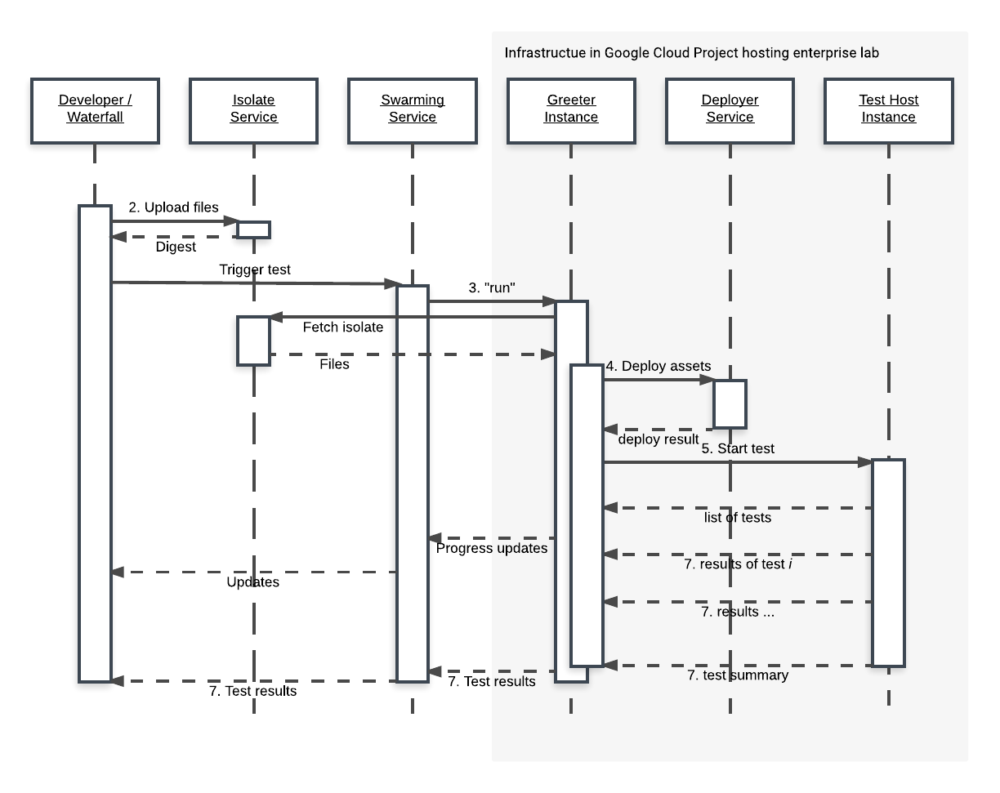
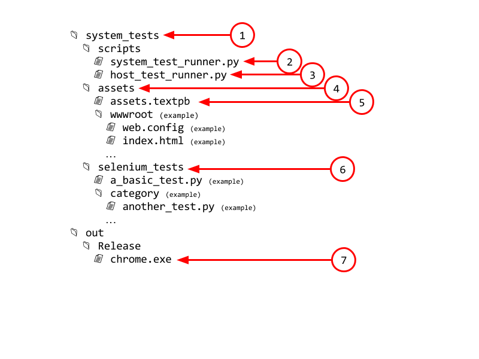
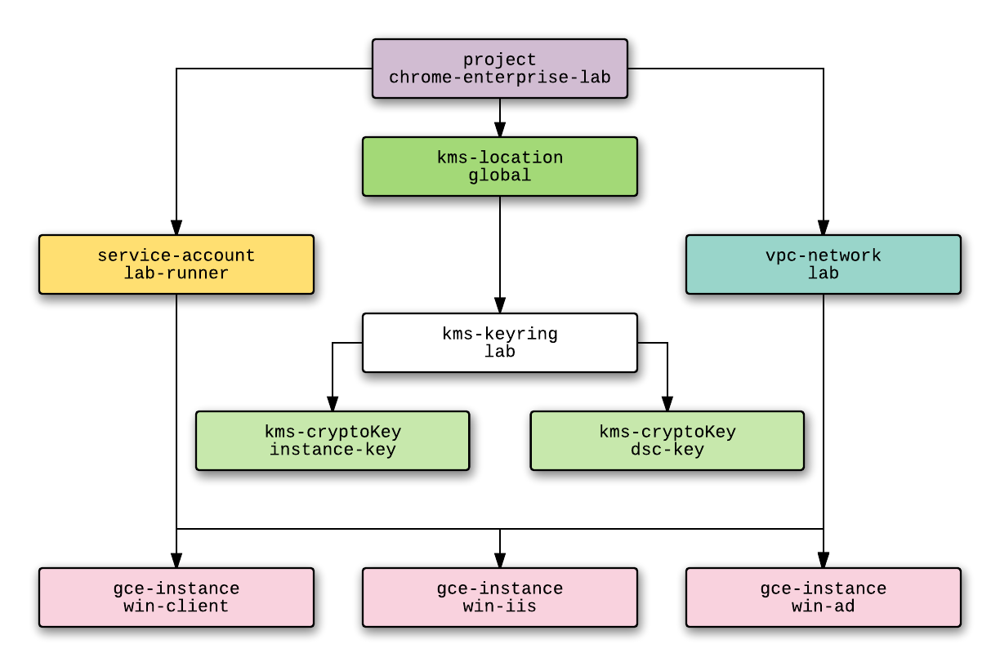

# DESIGN SUMMARY

*** promo
Instead of building a lab, build a toolchain for building labs.
***

[TOC]


## OBJECTIVE                                                        {#objective}

*   Make it feasible for testers to replicate new and exciting\* enterprise
    configurations.
*   Make it feasible for developers working on enterprise related features to
    test how their features interact with common enterprise environments.
*   Make it feasible for continuous integration testing to cover system level
    enterprise behavior.
*   Lay the foundation for developing and maintaining a growing inventory of
    enterprise fixtures and test cases that together publicly describe the scope
    of Google Chrome's enterprise support.

*** aside
\* Edge case that break Chrome sometimes turn out to be bewildering, strange and
counterintuitive. Replicating such configurations can be equal parts
frustrating, confusing and, exciting.
***


#### The Product

The final product of this exercise will be:


1.  **A mechanism for textually describing an enterprise environment**,
    including the network topology, servers and their services, clients, users,
    and physical components like physical appliances, networks and other
    devices, Windows services, Windows Active Directory (AD) domains, AD users,
    AD groups, Windows Certificate Services, PKI, various flavors of proxies,
    and anything else we'd need to describe in order to replicate enterprise
    environments.  See [Asset Description Schema]
    and [ASSET MANIFEST].

[Asset Description Schema]: schema-guidelines.md

1.  **A mechanism for textually describing the concrete details for how the
    enterprise environment should be realized**. For a lab that's hosted in GCP,
    this will include the GCP project name, instance images to use when creating
    VMs for each operating system, external static IPs to use, and locations of
    fixed assets like physical appliances.  See [HOST ENVIRONMENT], and
    [On-Premise Fixtures].

[On-Premise Fixtures]: on-premise-fixtures.md

1.  **A set of tools for taking the above textual descriptions and constructing
    a lab in a GCP project**, in whole or in part.  See [DEPLOYER].

1.  **A mechanism for running a set of tests within a lab**.  See [ISOLATE],
    [GREETER], [SYSTEM TEST RUNNER], [HOST TEST RUNNER], and last but not least
    the [TEST].

1.  **A basic set of end-to-end tests for Chromium, including the descriptions
    of the required resources**. These tests will live in the Chromium source
    tree and will become part of our CI suite.

1.  **A mechanism by which these end-to-end tests can be invoked manually using
    binaries built on a developer workstation**.  See [Expected Workflows].

[Expected Workflows]: workflows.md

1.  **A mechanism by which these end-to-end tests can be invoked via the
    Chromium waterfalls**.  See [Integration With Chromium Waterfall].

[Integration With Chromium Waterfall]: chrome-ci-integration.md

1.  And finally, **at least one instance of the enterprise lab hosted on Google
    Cloud Platform that's integrated with the Chromium waterfall as an FYI bot
    for continuous integration testing, and another instance integrated as a try
    bot**.


#### 10000 Foot View


*   The Chrome Enterprise Lab comprises of a toolchain for building labs.
*   Each such lab consists of virtual and physical devices. The virtual devices
    are hosted and constrained to a single Google Cloud Platform (GCP). Physical
    devices can be hosted anywhere.
*   A single enterprise lab instance can host multiple networks and multiple
    enterprise environments.
*   Tests run on virtual machines inside the lab, and on managed hardware.
*   The subject being tested can be a Chrome binary produced on the Chromium
    waterfalls or on a developer desktop, or an arbitrary test binary.
*   The primary class of tests involve automating the subject Chrome binary so
    that it accesses network resources from within its environment. Selenium is
    used for automating the browser, and the tests are formulated as Python unit
    tests.


#### Life of a System Test

There can be multiple types of tests. The one referred to here is a system test which is written in Python and uses Selenium + ChromeDriver to automate a Chrome binary.


1.  A developer or the waterfall produces candidate test binaries.
1.  Test binaries along with test scripts, dependencies, and a description of
    the assets needed to run the test are uploaded to Luci Isolate by the
    builder.
1.  Luci Swarming is used to schedule a test run and picks a swarming bot within
    the lab GCE project. This special bot is called a GREETER.
1.  GREETER receives the `run` request from Luci Swarming and downloads the
    isolate. The isolate includes a system test script which is responsible for
    preparing and running a test suite within the lab.
1.  The system test script invokes a service, called a DEPLOYER, to deploy (or
    create) necessary virtual assets into the lab including the machines that
    will ultimately run the test. The service also leases physical assets that
    can then be used by the lab.
1.  The system test script constructs a package of files containing per-host
    test scripts and their dependencies (the actual tests being performed) along
    with test binaries (a.k.a. The compiled browser) and sends them over to the
    hosts identified as test hosts by publishing a message to a PubSub topic.
    The distribution of these files is done over Google Cloud Storage.
1.  A component on each test host subscribes to a PubSub topic which the GREETER
    uses to notify test hosts of the new test package.
1.  The test host downloads and invokes the per-host test script contained
    within the package.
1.  The per-host test script runs the test using Selenium to automate the
    browser binary under test.
1.  Test results percolate up to the swarming service via a PubSub topic where
    they are aggregated and funneled back to the test invoker which is either a
    waterfall, or a developer's machine.





## Concepts


### The ISOLATE (A Collection of Files)                               {#isolate}

We start our story when a build has completed and the build artifacts needed for
running the test are ready. These artifacts may be produced on the waterfall or
on a developer machine.

The collection of files needed for running the test in isolation are bundled
together and uploaded to a Luci Isolate server. The process of uploading yields
a digest that uniquely identifies the specific set of uploaded files and their
relative layout.

The contents of the isolate (i.e. the files contained therein) are as follows
(Note that the exact layout may be different, but the content should be as
described below):





1.  `system_tests/` is the contents of the similarly named directory under in
    the Chromium source tree. See [Source Code Locations] for details. The
    isolate includes the entire contents of the directory excluding the `doc/`
    subdirectory. These files will be transferred over to the enterprise lab for
    execution.

1.  The `system_test_runner.py` file lives in `system_tests/scripts/`. It is the
    main entry point for system tests and is invoked via `task_runner.py`
    ([source](https://github.com/luci/luci-py/blob/master/appengine/swarming/swarming_bot/bot_code/task_runner.py))
    on the [GREETER]. This script is described in [SYSTEM TEST RUNNER].

1.  The `host_test_runner.py` file also lives in `system_tests/scripts/`. This
    script is responsible for running tests on individual [TEST HOST]s, and is
    described in [HOST TEST RUNNER].

1.  The `assets/` directory contains the definitions of the assets that should
    exist in the enterprise lab. Files and directories in this directory can be
    referenced by the definitions in `assets.textpb` and are used to configure
    things like IIS and ActiveDirectory.

1.  `assets.textpb` is a text formatted protobuf describing all the assets
    needed by the system tests. Described in [ASSET MANIFEST].

1.  Everything in the `selenium_tests/` directory comprise the tests that will
    be executed in the lab using Selenium. For example, the `a_basic_test.py`
    and `another_test.py`. Described in [The TEST].

1.  Last, but not least, the [browser
    binary](https://www.google.com/chrome/browser/desktop/index.html?brand=CHBD)
    being tested.

Once the isolate is uploaded to an
[isolateserver](https://github.com/luci/luci-py/blob/master/appengine/isolate/README.md),
it is ready to be downloaded and used by the bots.

*** note
**Note:** The ISOLATE described above is specific to the Selenium based tests
that are proposed in this document. In addition to those, the design allows for
additional types of tests as described in the [Source Locations] section.
***


### The ASSET MANIFEST (An inventory of assets in text form)   {#asset-manifest}

All assets required by the test suite are described in the ASSET MANIFEST. In
this document the asset manifest is often referred to as `assets.textpb`, but in
reality it will be a collection of files.

The manifest takes the form of a `textproto` file conforming to the [Asset
Description Schema]. By virtue of the chosen schema, the file can trivially be
broken into multiple files. This aspect is important since it is expected that
some of the asset manifest fragments will be programmatically generated to
account for the matrices of configurations that need to be supported. The lab
does not care how or where the files were generated, but just that all the
required pieces are there by the time the [DEPLOYER] is invoked.

To the fullest extent possible, the asset manifest also aims to be independent
of the specifics of the Google Cloud Platform. A different implementation of the
DEPLOYER, for example, could theoretically target a different cloud hosting
solution without changing the asset manifests.

**What is an asset?** It's just about anything physical or virtual that needs to
be specified in order for the test fixtures to be unambiguously deployed. Assets
include descriptions of networks including subnets and address ranges, peering
between these networks, VPNs, virtual machines including parameters required to
provision them, Windows Active directory domains, domain users,  domain groups,
Active Directory containers, trust relationships between the domains, Windows AD
group policy templates, group policy objects that should be deployed to each AD
container, and so on.

The [Asset Description Schema] is designed for expressiveness, but not
necessarily for readability or writability since it is expected that much of the
asset descriptions will be programmatically generated.

**What doesn't go in the manifest?** The asset manifest should be independent of
its hosting environment. As such, the manifest does not prescribe a specific
hosting Google Compute project, nor does it specify hosting environment specific
parameters like static external IPs, SSL certificates, references to Google
Cloud Storage buckets, and StackDriver logging parameters. Such parameters are
defined in the [HOST ENVIRONMENT] as described below.

*** note
**Note**: The [ASSET MANIFEST]s describing Chromium end-to-end test requirements
is public. It is expected to be checked into the Chromium repository.
***

Examples of assets include:

*   VM instances running specific operating systems. E.g. A client VM running Windows 10, a server VM running Windows Server 2016.
*   Virtual networks, including per instance firewall rules.
*   Windows Active Directory domains, containers, users, machines.
*   Windows Active Directory Group Policy templates and policy objects.
*   Windows IIS Server instances.
*   Individual web sites running on said IIS servers.
*   Windows Certificate services.
*   Certificates to be issued by Windows Certificate Services.
*   DNS zones, CNAME records, ...
*   Test host VMs ([TEST HOST]) which are a subset of the VM instances described in the file.

For more information about the structure of assets, see [Assets] below.


### The HOST ENVIRONMENT (The foundation upon which the lab sits)

{#host-environment}

While the ASSET MANIFEST describes what goes into the enterprise lab, the HOST ENVIRONMENT describes the environment in which the lab itself sits. For example, the HOST ENVIRONMENT defines:


* The **Google Cloud Project** where the enterprise lab is to be instantiated.
  All cloud resources described in the ASSET MANIFEST will be created within
  this single project.

* **Google Cloud Storage buckets** to use during deployment. These storage
  buckets are used for transferring files to be used by GCE instances during
  startup and for configuration. 

* **External IPs**. When GCE instances need to be externally visible, they
  need to be assigned external IPs. The ASSET MANIFEST refers to such external
  IPs by name, and the HOST ENVIRONMENT maps these names to IP addresses.

* **GCE Instance Images**. These are the images that are used as source disks
  when creating GCE instances. E.g. An ASSET MANIFEST might declare that an
  instance be based on `win10`. The HOST ENVIRONMENT describes the image family
  and project that should be used to locate the image, e.g.:
  `windows-cloud/windows-2016`. 

  Google Compute Engine has a growing [inventory of public
  images](https://cloud.google.com/compute/docs/images#os-compute-support).
  However the enterprise lab will need to rely on private images for the purpose
  of testing against Windows 7 and Windows 10 which are currently popular in
  enterprise but not supported on GCE. Source images for these operating systems
  cannot be made available publicly due to licensing issues. Hence the HOST
  ENVIRONMENT needs to specify how these images are to be located. See [Private
  Google Compute Images].

* **Permanent Assets**. These are assets that can't be deployed automatically.
  Such assets must already exist by the time the DEPLOYER gets around to
  constructing assets. Permanent assets include external physical labs, and
  virtual machine instances that need to be deployed manually due to licensing
  and activation requirements.

Unlike the ASSET MANIFEST, the HOST ENVIRONMENT is necessarily private. Each
instantiation of the enterprise lab needs to specify its own HOST ENVIRONMENT
during the [Bootstrapping] process.

The HOST ENVIRONMENT takes the form of a textproto file that is made available
during Bootstrapping. It conforms to the `HostEnvironment` message  in the
[Asset Description Schema].

Between the HOST ENVIRONMENT and the ASSET MANIFEST, these files contain all the
information necessary to construct an instance of the enterprise lab from
scratch. The details of how this deployment happens is described in the
[Deployment Details] section.


### The GREETER (A Swarming Bot)                                      {#greeter}

Test execution proper starts when a GREETER VM receives a notification that a
test is ready to be deployed to the test machines. This notification includes
the identifier of the ISOLATE containing the files needed to run the test suite.

A GREETER is a swarming bot ([described
here](https://github.com/luci/luci-py/blob/master/appengine/swarming/doc/Bot.md)).
As such, a notification for a new test run takes the form of a `run` command
issued to the bot from the swarming server.

In addition to being swarming bots, GREETERs are …

*   … the only entry points for automated tests regardless of whether the test
    was triggered automatically or manually.
*   … run with unprivileged service accounts that cannot create VMs and perform
    other modifications to its Google Compute Engine environment. This
    capability is held by the [DEPLOYER] service.
*   … identified by swarming due to their special swarming dimension
    `pool:enterprise-lab`

Once a GREETER VM is notified of an isolate (via swarming or otherwise), it
invokes the isolate via `task_runner.py`
([source](https://github.com/luci/luci-py/blob/master/appengine/swarming/swarming_bot/bot_code/task_runner.py)).
This downloads and invokes the embedded test script from the [ISOLATE]. The
embedded test script for system tests is described in [SYSTEM TEST RUNNER].

A single GREETER and a single DEPLOYER can be presumed to exist in the lab. It
is possible for any and all other test fixtures and [TEST HOST] VMs to not
exist, in which case they will be created by the [DEPLOYER]. GREETERs are the
only VMs that can be exposed externally.

*** note
**Note:** Since the entire test lab environment is customized to run a single
test suite during a test run, a lab can only reliably run a single test suite at
a time. Hence it doesn't make sense to have more than one GREETER per lab. See
the [Scalability] section.
***


### The SYSTEM TEST RUNNER (The `system_test_runner.py` Script)

{#system-test-runner}

This is the logic described in the file named `system_test_runner.py` included
in the [ISOLATE] and exists in the Chromium source tree. It is extracted and
invoked by the swarming bot code running on GREETER. The script itself also runs
on the GREETER.

*** note
**Note**: There could be other types of test runners in the ISOLATE, but the
only type that's currently planned to be supported is the system test runner
described in this section. Any other type of test would need to deal with
deploying the test fixtures and test runners by invoking the `cel_py` library (
[described below][cel_py]).
***

The SYSTEM TEST RUNNER needs access to the test environment specific code for
invoking the [DEPLOYER] and setting up the communication channels between the
SYSTEM TEST RUNNER and HOST TEST RUNNERs. The API for accessing these services
is provided by a Python library called `cel_py` ( [described below][cel_py])
which is installed on GREETERs as well as TEST HOSTs.

This SYSTEM TEST RUNNER performs the following operations:


1. Invokes [DEPLOYER] with the [ASSET MANIFEST] as input and waits for the
   deployment phase to finish successfully. The DEPLOYER ensures that all
   required assets are present in the lab.

   If this step completes successfully, then all the TEST HOSTs described in the
   ASSET MANIFEST can be assumed to exist and be operational.

   As a part of the deployment results, the DEPLOYER sends back a comprehensive
   inventory of the software that's running in the lab. This inventory includes
   software versions and hotfix information. The SYSTEM TEST RUNNER passes along
   this information to `stdout`.

2.  Deploys the tests to *all* the [TEST HOST]s identified in the ASSET MANIFEST
    as follows:

    1.  Constructs an archive containing `host_test_runner.py` (described in the
	[HOST TEST RUNNER] section) and the contents of the `system_tests`
	folder from the ISOLATE.

    2.  Write the archive to a Google Cloud Storage bucket.

    3.  Publishes a message to [Google Cloud
	Pub/Sub](https://cloud.google.com/pubsub/) topic `tests` that includes
	the location in Google Cloud Storage of the archive.

	The TEST HOSTs created by the DEPLOYER subscribe to this Pub/Sub topic
	and start their tests accordingly.
        
	SYSTEM TEST RUNNER must subscribe to topics named `results-<hostname>`
	for each hostname corresponding to the known TEST HOSTs. This is the
	mechanism by which TEST HOSTs communicate test results.
        
    4.  Streams all incoming messages from TEST RUNNERs to the embedding script
	(i.e. the SYSTEM TEST RUNNER).

3.  Collects the test results passed along via `cel_py`, and streams it back to `stdout`.

4.  Constructs aggregate test results and streams these via `stdout`.

    These results include:
	1.  Counts of tests that were run along with the times taken for each.
	2.  Tests that were skipped on all TEST RUNNERs.
	3.  TEST RUNNERs that stalled. In the future, we could retry these tests
	    inline instead of requiring another test run.

*** aside
**Why not use Chrome infra's Isolate instance or another Isolate instance
running inside the lab project for transferring files?**

One of the goals of this effort is to make it possible for an individual
developer or a team to easily clone the environment for the purpose of
developing new tests or running manual tests. In that regard it is
desirable to keep the set of dependencies minimal. Running an Isolate
server is makes sense for distributing binaries in the scale at which
Chrome infra in general operates, but isn't feasible for a small scale
such as this lab.
***

*** note
**Note**: *All* tests are scheduled on *all* the test runners.  See the [TEST]
section below for details on how an individual test is expected to pick which.
***


### The DEPLOYER (A Service)                                         {#deployer}

The DEPLOYER is a service that takes an ASSET MANIFEST as input and deploys the
specified assets to the Google Compute Engine environment based on it. The
DEPLOYER runs on a separate VM and is invoked by the [SYSTEM TEST RUNNER].

The DEPLOYER does the following:

1.  Parses the ASSET MANIFEST, and the HOST ENVIRONMENT and constructs a
    dependency graph for all the assets that are required by the test.

    For example, an Instance asset depends on a Network asset, a Windows domain
    user asset depends on the Windows domain asset. A diagram showing the
    dependency graph for compute engine assets for a simple test is shown below:

    

    In the diagram above, `gce-instance/win-client` identifies a Google Compute
    Engine instance named `win-client`.

1.  Traverses the dependency graph in topological order and:
    1.  Creates the asset if the the asset does not exist.
    1.  Purges and re-creates the asset if the existing asset does not meet the
	requirements set forth in the ASSET MANIFEST.

The assets that are handled by DEPLOYER are not just assets known to Google
Compute Engine. They are also things that exist within the lab environment like
Windows domain accounts and software that needs to be installed on the virtual
machines.

See the [Deployment Details] section for full details on how these assets are
deployed.

Upon successful completion of deployment,

*   All [TEST HOST]s can be assumed to exist.
*   Pub/Sub topics `results-<hostname>` can be assumed to exist for each [TEST
    HOST].
*   Each [TEST HOST] can be assumed to have created a subscription for Pub/Sub
    topic `tests`.

Subsequently when the [SYSTEM TEST RUNNER] announces the new tests, all [TEST
HOST]s should be ready to respond.


### The TEST HOST (A Virtual Machine)                               {#test-host}

The TEST HOST is a VM that runs a test. These VMs are deployed by the DEPLOYER
based on the ASSET MANIFEST included in an ISOLATE.

The TEST HOST must have all the software necessary to run the test with the
exception of the code that's included in the ISOLATE. At a minimum, the TEST
HOST has:


*   The bot controller `cel_bot` ([described below][cel_bot]).
*   Selenium, along with WebDriver implementations - ChromeDriver and
    InternetExplorerDriver.
*   A Python library `cel_py` for inspecting the TEST HOST environment. The
    library also has some additional utilities for marking tests as disabled and
    conditionally skipping tests based on host dimensions.
*   A Python 2.x interpreter.

Different TEST HOST instances can have different characteristics. The different
characteristics are exposed as tags in the VM. E.g.: A tag
`policy-ntlm-disabled` can indicate that the GPO disabling the HTTP
authentication scheme NTLM was applied to the TEST HOST.

The TEST section describes how these tags are used in tests.


### The `cel_bot` Tool                                                {#cel_bot}

When a TEST HOST instance starts up, it runs a program named `cel_bot`. It:

*   Creates a subscription for the Pub/Sub topic `tests` within the GCE project.
    The topic is the means by which a SYSTEM TEST RUNNER communicates the start
    of a test to a TEST HOST.

*   Listens for incoming tests via the `tests` Pub/Sub topic.

*   Upon receipt of a test - which takes the form of a path to an archive hosted
    on Google Cloud Storage - downloads, extracts and runs the test script
    contained in the archive. The test runner contained therein is referred to
    as the HOST TEST RUNNER.

*   Once the test completes, or times out, the `cel_bot` is also responsible for
    collecting logs and other test artifacts and making them available to the
    SYSTEM TEST RUNNER.


### The HOST TEST RUNNER (The `host_test_runner.py` Script)  {#host-test-runner}

This script is responsible for running the tests on one of the TEST HOST
instances. The script itself lives in `/TBD/` and depends on a `system_tests`
directory that's expected to exist alongside it.

Once invoked, the HOST TEST RUNNER:

*   Performs the `load_tests` protocol as defined by Python `unittest` to locate
    tests.

*   Announces the list of tests about to be run via the `results-<hostname>`
    Pub/Sub topic.

*   Announces the test host properties including software versions, and
    [Resultant Set of
    Policy](https://technet.microsoft.com/en-us/library/cc758010(v=ws.10).aspx).
    The software versions including hotfix information for test fixtures are
    reported during the deployment phase by the DEPLOYER and passed along by the
    SYSTEM TEST RUNNER. The HOST TEST RUNNER only needs to concern itself with
    the software on the TEST HOST.

*   Invokes `unittest` along with a custom Python `TestRunner` class which
    publishes test results via the `results-<hostname>` topic.


### The TEST (A Python `unittest`)                                       {#test}

Tests live under `/TBD/` and are structured as Python `unittest`s. They are
invoked on a candidate TEST HOST via a HOST TEST RUNNER.

Tests must be designed so that a component on a volatile TEST HOST runs against
a set of stateless test fixtures. Tests must be:

*   **Idempotent**: Given a single test suite session, the test should be able
    to run multiple times with the same outcome.
*   **Isolated within the lab**: This one's a jiffy.

    A test should only depend on test fixtures that are declared in the
    accompanying ASSET MANIFEST. Necessarily, tests are run with real host
    resolvers and run against real services. However, tests should not reach out
    to services outside those provided in the lab.
    
    Chromium/Chrome currently depend on a smorgasbord of Google services. See
    the [Google Services] section for details on how to deal with Google
    Services that affect the browser including field trials.

*   **Not depend on the absence of a resource**: While a test should declare and
    can depend on specific test fixtures, it should not depend on a test fixture
    being absent despite it not appearing in its assets manifest.

    What does this mean? A test should not depend on, say, that an `A` query for
    `bar.example.com` getting an NXDOMAIN. This will break if another test adds
    a `bar.example.com` resource.

Proper adherence to the above rules mean that multiple test suites can occupy
and execute within the same GCE project simultaneously. Ref. [Scalability].

The test may assume that its containing directory and subdirectories have the
same contents as the subtree rooted at `/TBD/`. It can also assume that the test
fixtures exist as per the ASSET MANIFEST and that the test itself is running on
one of the TEST HOST instances defined in the ASSET MANIFEST. The `cel_py`
library can be used to determine the name and characteristics of the TEST HOST
running the test.

Contents of a hypothetical example test file follows:
`//chrome/test/enterprise/system_tests/basic_test.py`...


``` py
import unittest
import cel  # cel_py client library
from selenium import webdriver

class TestFoo(unittest.TestCase):

  def test_basic(self):
    driver = cel.ChromeDriver()            # Connects to Chrome binary under test.
    driver.get("http://www.google.com")
    self.assertIn("google", driver.title)
    driver.close()
  
  @cel.require(["policy-ntlm-disabled", "policy-never-use-proxy"])
  def test_policy(self):
    driver = cel.ChromeDriver()            # Connects to Chrome binary under test.
    driver.get(cel.NamedUrl("ntlm-only-over-http")
    self.assertIn("authorization required", driver.title)
    driver.close()
```


In `test_basic()`, the `cel.ChromeDriver()` call binds to a WebDriver instance
that's invoking the Chrome binary under test. Currently we are not planning on
using remote WebDriver instances.

In `test_policy()`, the `@cel.require()` annotation causes the test to be
skipped if either of the two listed tags are not present on the TEST HOST. In
addition, the `cel.NamedUrl()` call looks up a named URL from the test
environment. The mapping from a named URL to a URL that can be used within the
lab is defined in the ASSET MANIFEST.


### The `cel_py` Library (A Python Library)                            {#cel_py}

The `cel_py` library (Chrome Enterprise Lab Python library) exists on the
GREETER and TEST HOST and encapsulates the logic for…

*   Talking to the DEPLOY service.

*   Constructing and uploading the archive containing per-host tests to Google
    Cloud Storage for consumption on the TEST HOST instances.

*   Constructing and marshalling a host test via a `tests` Pub/Sub topic.

*   Subscribing to and initiating a test run based on a `tests` Pub/Sub topic.

*   Downloading and extracting said archive on the TEST HOST.

*   Constructing and marshalling test results to a `results-<hostname>` Pub/Sub
    topic.

*   Subscribing to and consuming messages from a `results-<hostname>` Pub/Sub
    topic.

*   Exposing instance tags and named assets to TESTs.

*   Controlling test execution via Python `unittest` friendly annotations so
    that tests can filter themselves based on instance tags. The outcome of
    these filtering operations are made available to test results so that
    `results-<hostname>` subscribers can clearly tell why a test was skipped.

In other words, the `cel_py` library encapsulates most of the lab-environment
specific logic for test execution both at the GREETER (SYSTEM TEST RUNNER) and
TEST HOST (HOST TEST RUNNER) level.

This separation allows the TEST to be written such that it's independent of how
the test lab is constructed.


<!-- BEGIN-INDEX -->
<!--
Index of tags used throughout the documentation. This list lives in
/docs/index.md and is included in all documents that depend on these tags.

In order to update the tags:

   1. Update `/docs/index.md`
   2. Run the following command from the root of the source tree:

         ./build.py format

Keep the tags below sorted.
-->

[ASSET MANIFEST]: design-summary.md#asset-manifest
[Additional Considerations]: background.md#additional-considerations
[Asset Description Schema]: schema-guidelines.md
[Background]: background.md
[Bootstrapping]: bootstrapping.md
[Concepts]: design-summary.md#concepts
[DEPLOYER]: design-summary.md#deployer
[Deployment Details]: deployment.md
[Deploying Scripted Assets]: deployment.md#deploying-scripted-assets
[Design]: design-summary.md
[Frameworks/Tools Used]: background.md#tools-used
[GREETER]: design-summary.md#greeter
[Google Services]: google-services.md
[HOST ENVIRONMENT]: design-summary.md#host-environment
[HOST TEST RUNNER]: design-summary.md#host-test-runner
[ISOLATE]: design-summary.md#isolate
[Integration With Chromium Waterfall]: chrome-ci-integration.md
[Objective]: design-summary.md#objective
[On-Premise Fixtures]: on-premise-fixtures.md
[Private Google Compute Images]: private-images.md
[SYSTEM TEST RUNNER]: design-summary.md#system-test-runner
[Scalability]: scalability.md
[Source Locations]: source-locations.md
[TEST HOST]: design-summary.md#test-host
[TEST]: design-summary.md#test
[The Product]: design-summary.md#the-product
[Use Cases]: background.md#use-cases
[Workflows]: workflows.md
[cel_bot]: design-summary.md#cel_bot
[cel_py]: design-summary.md#cel_py

<!-- END-INDEX -->
