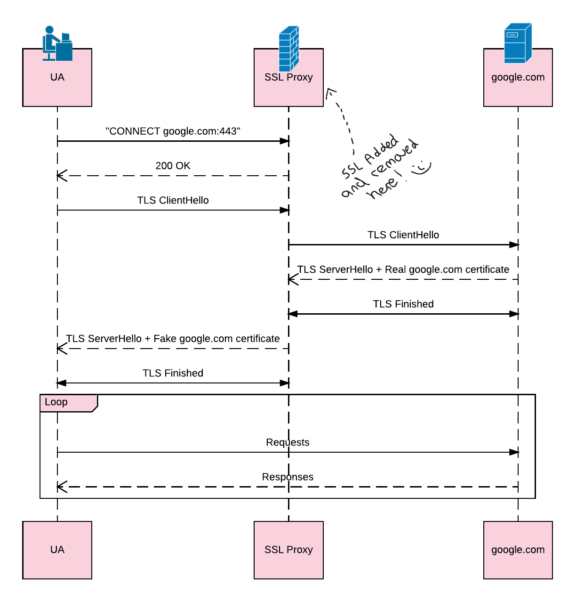
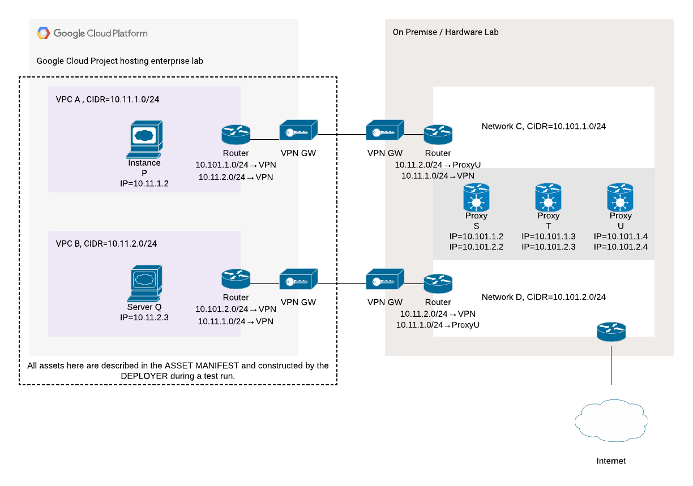
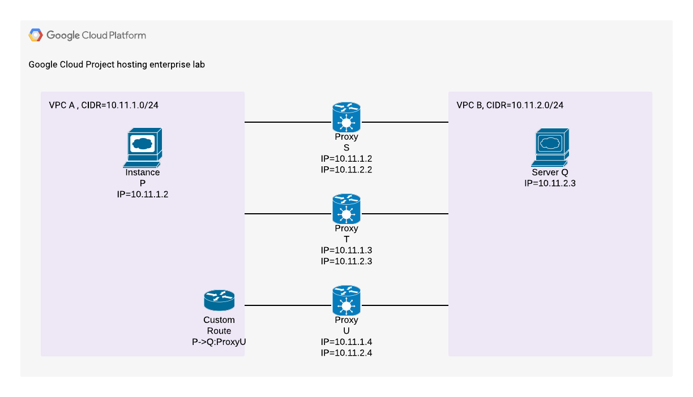

# On-Premise Fixtures

[TOC]

## Background

On-premise middleboxes are the cause of multiple compatibility issues over the
years. As such, we have identified testing against them to be an important use
case for the enterprise lab.

### About SSL Interception

A middlebox that intercepts SSL traffic is referred to here as a SSL Proxy.

Enterprises use middleboxes for loss prevention, auditing, regulatory
compliance, management or caching purposes. Some of these middleboxes actively
interfere with traffic including intercepting SSL traffic via the use of
intercepting certificates. An executive overview of how the latter is performed
can be found
[here](https://www.bluecoat.com/sites/default/files/documents/files/How_to_Gain_Visibility_and_Control_of_Encrypted_SSL_Web_Sessions.a.pdf)
(PDF link), which is specific to the Blue Coat ProxySG product. The approach is
quite general and is used by a number of other products and is explained briefly
below.

SSL interception involves intercepting outgoing SSL connections and then
presenting the UA with a minted fabricated certificate. The process involves
three actors: the User Agent (UA), SSL Proxy, and google.com.

1.  The UA initiates an SSL tunnel via an HTTP CONNECT verb. The SSL Proxy
    allows the tunnel with a HTTP 200 response.

1.  The UA then attempts a TLS handshake through the tunnel. Rather than the
    handshake being between the UA and google.com, it is intercepted by the SSL
    Proxy which responds with a fake google.com certificate. This concludes the
    TLS handshake which results in a TLS channel between the UA and the SSL
    Proxy that's established under the fake google.com certificate.

1.  During the handshake with the UA, the SSL Proxy attempts a TLS connection
    with google.com. The latter presents google.com's real certificate which the
    SSL proxy MUST verify before establishing the tunnel between the UA and the
    SSL proxy. 

    This step is usually performed prior to minting the fake google.com
    certificate since the fake certificate typically uses the same subject name
    and [subject alternative
    names](https://en.wikipedia.org/wiki/Subject_Alternative_Name) as the real
    certificate.

1.  At this point, a TLS connection exists between the UA and the SSL Proxy, and
    a corresponding connection exists between the SSL Proxy and google.com.
    Requests sent from the UA are funnelled to google.com by the SS Proxy.
    Similarly responses from google.com are funnelled to the UA.

The SSL Proxy is in possession of the private key for the fake certificate and
hence is able to terminate the SSL connection and examine the requests and
responses between the UA and google.com. The fake certificate is signed with a
Certificate Authority (CA) whose certificate is added to the list of trust roots
for the UA. The CA in this case is not a public trust root, but one that's
created by the SSL proxy. The private key corresponding to the CA is [hopefully]
specific to the device.

The addition of the CA certificate to the UA's list of trust roots is sufficient
to suppress warnings by the UA about the authenticity of the certificate. In
other words, the UA is configured to trust server certificates issued by the SSL
proxy.

During this process, the SSL Proxy may:

*   Redirect and display a notification that the user's connection to the target server is being intercepted.
*   Block the connection entirely.
*   Block the connection partway if it detects some sort of contraband is being transmitted over the connection.
*   Allow the connection to pass through without any interception.

The details of how outgoing SSL connections are identified, and how the SSL
proxy decides which connections are intercepted and which are allowed the pass
through or blocked vary from product to product and also varies based on how the
product is configured.

In the example above, the SSL Proxy is configured as an *explicit proxy*. I.e.
one that the UA is configured to treat as an HTTP proxy. Thus the UA connects to
any SSL endpoint via the [HTTP CONNECT
verb](https://en.wikipedia.org/wiki/HTTP_tunnel).

Another mode of operation for an SSL Proxy is to act as a *transparent proxy*
where it actively examines all traffic, and then intercept a connection where
the traffic "looks like" a TLS handshake. In this mode, the SSL Proxy plays the
role of a gateway for the local network. Thus it is able to inspect and
intercept all egress and ingress traffic to the local network. No further
configuration is required for the UAs other than the injection of the CA
certificate into its list of trust roots.

### Requirements

The testing requirements were evaluated against the following four products. I
don't have numbers on which middle boxes are the most popular in terms of seat
count. So the choices are based on what the BoringSSL folks were interested in
due to various incompatibilities with middleboxes they've run into while working
on TLS 1.3.

*   Fortinet FortiGate/FortiWiFi

*   WatchGuard Firebox T10/T10-W

*   Symantec Blue Coat ProxySG S200

*   Symantec SWG VA-100

Of these, Symantec SWG VA-100 is a special case since it's a virtual appliance
(i.e. it can run as a virtual machine). The other three are physical devices
that are meant to be hooked up to on-premise network hardware in order to work.
Notably, WatchGuard Firebox is also available as a virtual appliance but only
the physical box is included in this list.

While virtual appliances are easier to test in a virtual environment such as
GCE, we would like to test the hardware appliances because there may be subtle
differences in behavior between the hardware appliance and the virtual
appliance. Where there are differences, we would like to test against the
behavior of the physical appliance based on the assumption that it is closer to
what enterprises are using in production.

## Overview of Network Topologies

### Topology For Physical Appliances

Physical appliances (e.g.: FortiGate, Firebox and ProxySG) need at least two
physical networks, one of which has access to the open internet. The latter is a
requirement for activation and license checking.

The proposed topology  places these devices dual-homed in two networks (C and D
in the diagram below) where one network is considered internal (network C in the
diagram), and the other is the external network (D). The device intercepts
traffic flowing from C to D.

Inside the Google Cloud Platform project that is hosting the enterprise lab,
there exists two VPC networks: A and B as noted in the diagram. Of these, one
network acts as the internal network (network A), and the other is the external
network (network B). This arrangement parallels the two physical networks C, and
D. There is no direct routes between A and B. Routes between A and B specify
their adjacent VPN gateways as the next hop.

IPSec VPNs bridge the gap between the virtual Google Cloud Platform networks and
the physical networks. For convenience, all four of these networks use IP
address spaces that are disjoint. The internal networks (A and C) can route
packets to each other, but have to cross over a IPSec VPN to do so. Similarly
the external networks (B and D) also route packets to each other over another
IPSec VPN.

In addition, the physical external network (D) has access to the internet.

With that, the appliances being tested can be installed dual-homed between C and
D. The internal and external interfaces on the appliances have addresses in C
and D respectively.

#### Testing Against Explicit Proxies

A GCE instance in VPC A (named instance P in the above diagram) can use any of
the proxies S, T, or U as an explicit proxy by specifying its IP address or by
name. The traffic from instance P to proxy S will follow the route:

1.  Instance P : Origin.
2.  VPN gateway in VPC A : Due to explicit route in VPC A.
3.  VPN gateway in on-premise network C : Other end of VPN tunnel.
4.  Proxy S : Address is in network C.

The target of the request (say, Server Q), must be resolvable by the proxy server.

#### Testing Against Transparent Proxies

This scenario requires that:

*   VPC A has a route for VPC B's address space that forwards to the VPN gateway in VPC A. I.e. all traffic to VPC B's address space goes through the VPN gateway.
*   On-premise network C has:
    *   A route for VPC B's address space that forwards to Proxy U.
    *   A route for VPC A's address space that forwards to the VPN gateway.
*   Proxy U has:
    *   A route for VPC B's address space that forwards to the interface connected to on-premise network D.
    *   A route for VPC A's address space that forwards to the interface connected to on-premise network C.
*   On-premise network D has:
    *   A route that forwards VPC B's address space to its VPN gateway.
    *   A route that forwards VPC A's address space to Proxy U.
*   VPC B has a route for VPC A's address space that forwards to the VPN gateway in VPC B.

Thus Instance P can now send traffic to Server Q that follows the route:

1.  Instance P : Origin.
1.  VPN gateway in VPC A : Due to VPC A's routing table.
1.  VPN gateway in on-premise network C : Other end of VPN tunnel.
1.  Network interface on Proxy U bound to network C : Due to routing table in network C.
1.  Network interface on Proxy U bound to network D : Due to routing table in Proxy U.
1.  VPN gateway in network D : Due to routing table in network D.
1.  VPN gateway in VPC B : Other end of VPN tunnel.
1.  Server Q : Destination.

Packets from Server Q destined for Instance P follow the same route in reverse
due to the routing tables specified above. Proxy U can now act as a transparent
proxy for since traffic in both directions between P and Q flow through U.

More than one transparent proxy can be tested simultaneously by narrowing the
address ranges along the way to include only Instance P and Server Q in place of
VPC A and VPC B respectively. Thus traffic between P and Q will still flow
through U. But it would also be possible to introduce an Instance P′ and a
Server Q′ that uses a proxy U′ as their transparent proxy. The three new devices
will reside in VPC A, VPC B and the on-premise networks respectively. Routes for
traffic between P′ and Q′ can co-exist with routes for P and Q as long as P, P′,
Q, and Q′ are distinct.

In addition, all these routes can co-exist with the routes necessary for testing
explicit proxies.

### Topology For Virtual Appliances

The topology for supporting virtual appliances is similar in principle to the
one supporting physical appliances, but much simpler since we don't need to do
the additional layer of indirection through a VPN to get from a virtual network
to a physical network.

As shown in the diagram above, we once again have two VPC networks in the Google
Cloud project hosting the lab. Let's call these A and B following the example
from the physical appliances section.

Google Compute Engine supports multihomed instances. Hence our virtual
appliances can be configured with multiple network interfaces where each
interface is assigned to a different VPC network.

**Testing Against Explicit Proxies**: A GCE instance P in VPC network A (the
"internal" network), can use any of the proxies as an explicit proxy. Since each
of the proxies can resolve the address for an instance in VPC network B, any
requests made by P to an instance in B can be satisfied by the proxies. In doing
so, the proxy will be in a position to intercept the request.

**Testing Against Transparent Proxies**: This can be achieved by introducing a
custom route from an instance in A to an instance in B that uses one of the
proxies as a gateway. Thus requests sent between these two instances will be
forwarded to the proxy allowing the latter to intercept the traffic.

## Deployment

The proposed goals for both of the proposals above -- namely the topologies for
the physical and virtual appliances -- is to allow for flexible deployment of
test environments. In the case of the topology for physical appliances:

*   The cloud VPC networks, VPN endpoints, client GCE instances, server GCE
    instances and routes inside the VPCs are described in the [ASSET MANIFEST]
    and constructed as needed by the [DEPLOYER].

*   Any subset of physical appliances can be selected for testing via the [ASSET
    MANIFEST].

*   The physical lab and the appliances that are currently available for testing
    are described in the [HOST ENVIRONMENT].

References to physical networks and physical appliances in the [ASSET MANIFEST]
must be resolved against the resources described in the [HOST ENVIRONMENT] at
the time the cloud assets are deployed. In order to facilitate fault tolerance
and allow for maintenance, the references in the [ASSET MANIFEST] only refer to
a class of resources, and the [HOST ENVIRONMENT] can specify a pool of matching
physical resources which the [DEPLOYER] can resolve against.

In the case of virtual appliances, the deployment details are TBD since some of
the components may need to be deployed manually due to licensing restrictions.

<!-- BEGIN-INDEX -->
<!--
Index of tags used throughout the documentation. This list lives in
/docs/index.md and is included in all documents that depend on these tags.

In order to update the tags:

   1. Update `/docs/index.md`
   2. Run the following command from the root of the source tree:

         ./build.py format

Keep the tags below sorted.
-->

[ASSET MANIFEST]: design-summary.md#asset-manifest
[Additional Considerations]: background.md#additional-considerations
[Asset Description Schema]: schema-guidelines.md
[Background]: background.md
[Bootstrapping]: bootstrapping.md
[Concepts]: design-summary.md#concepts
[DEPLOYER]: design-summary.md#deployer
[Deployment Details]: deployment.md
[Deploying Scripted Assets]: deployment.md#deploying-scripted-assets
[Design]: design-summary.md
[Frameworks/Tools Used]: background.md#tools-used
[GREETER]: design-summary.md#greeter
[Google Services]: google-services.md
[HOST ENVIRONMENT]: design-summary.md#host-environment
[HOST TEST RUNNER]: design-summary.md#host-test-runner
[ISOLATE]: design-summary.md#isolate
[Integration With Chromium Waterfall]: chrome-ci-integration.md
[Objective]: design-summary.md#objective
[On-Premise Fixtures]: on-premise-fixtures.md
[Private Google Compute Images]: private-images.md
[SYSTEM TEST RUNNER]: design-summary.md#system-test-runner
[Scalability]: scalability.md
[Source Locations]: source-locations.md
[TEST HOST]: design-summary.md#test-host
[TEST]: design-summary.md#test
[The Product]: design-summary.md#the-product
[Use Cases]: background.md#use-cases
[Workflows]: workflows.md
[cel_bot]: design-summary.md#cel_bot
[cel_py]: design-summary.md#cel_py

<!-- END-INDEX -->
